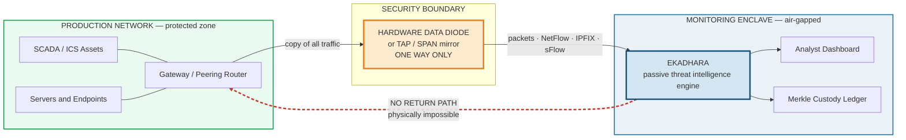
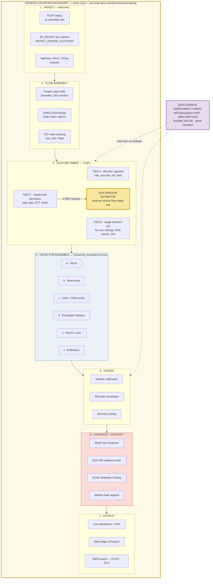
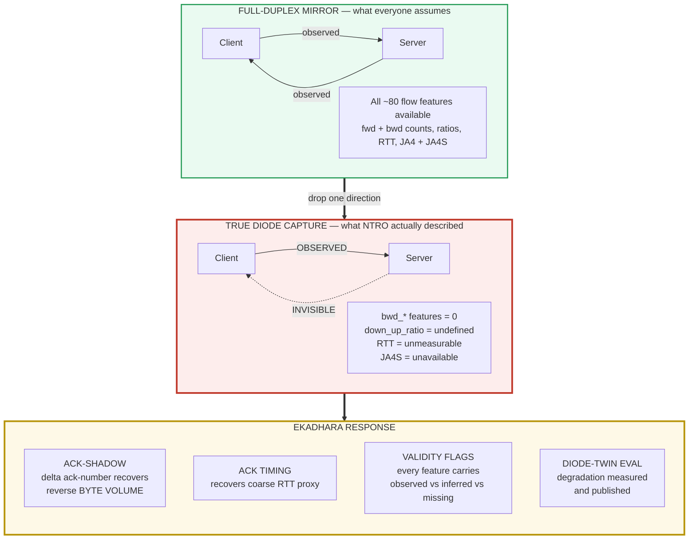
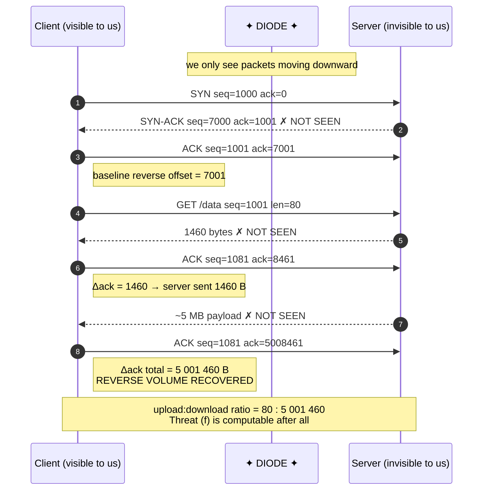
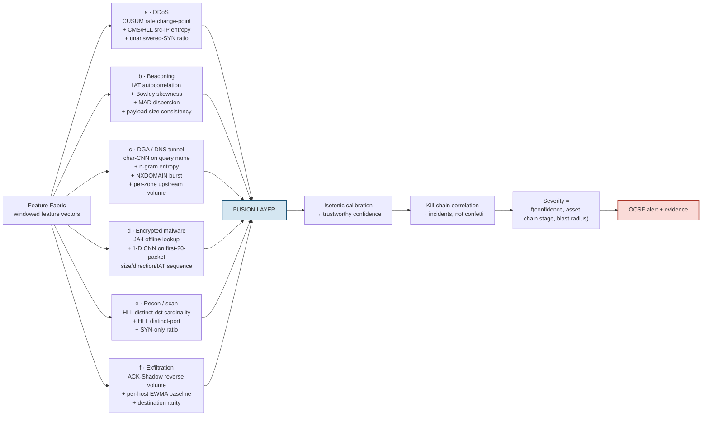
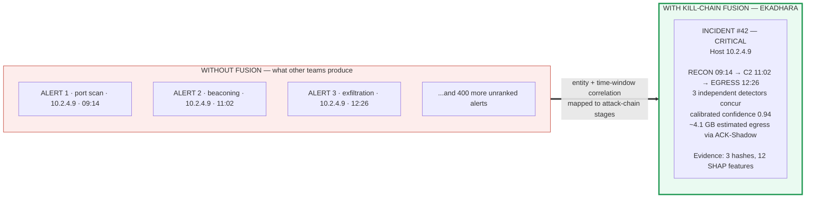
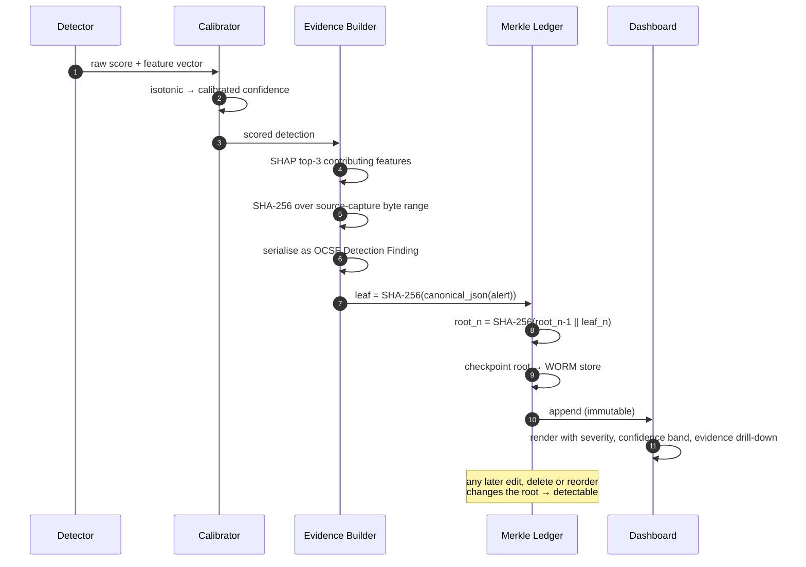
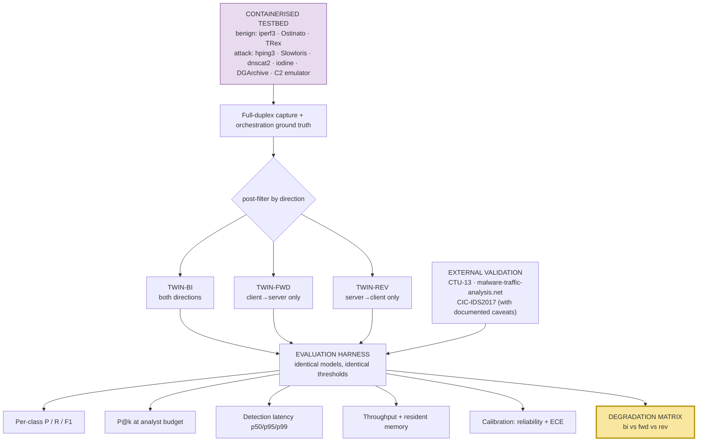
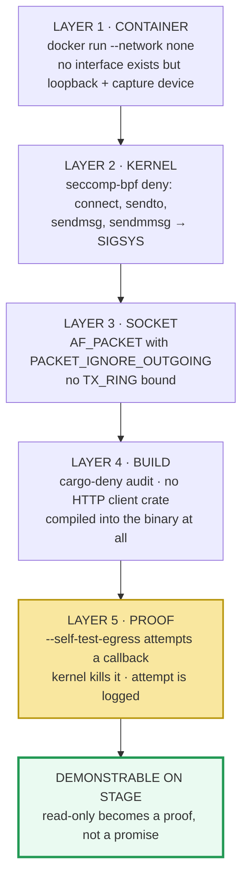

# Architecture & Flowcharts (PPT-ready)

All diagrams are Mermaid. Render at [mermaid.live](https://mermaid.live) → export SVG/PNG → drop into slides.
Recommended export: **transparent background, 2× scale**, so they stay crisp on the SIH template.

---

## FIG-1 — Deployment context: where EKADHARA sits

> **Use on:** Slide 1 (Proposed Solution). This diagram alone explains the problem to a judge who has never heard of a data diode.

**Speak to it:** *"Everything left of the orange box is what we protect. Everything right of it is where we live. The red dotted line is the arrow that does not exist — and that constraint is the entire problem."*

---

## FIG-2 — End-to-end pipeline (the master architecture slide)

> **Use on:** Slide 2 (Technical Approach). This is the single most important diagram in the deck.

---

## FIG-3 — The core insight: what a diode takes away, and how we take it back

> **Use on:** Slide 1 or 2, next to the "Innovation & Uniqueness" bullet. **This is our winning diagram.**

---

## FIG-4 — ACK-Shadow reconstruction, step by step

> **Use on:** the Innovation slide, or as a backup slide for Q&A. Draw it live if a judge challenges you.

**Edge cases handled:** 32-bit sequence wraparound (wrap counter), duplicate ACKs (loss correction), SACK blocks (finer granularity), zero-window probes (excluded).

---

## FIG-5 — Detector ensemble internals

> **Use on:** Slide 2 appendix, or the technical write-up.

---

## FIG-6 — Kill-chain fusion: three alerts become one incident

> **Use on:** Slide 4 (Impact & Benefits) — it shows the analyst's experience, not just the tech.

---

## FIG-7 — Alert lifecycle and custody chain

> **Use on:** the Merkle / forensics innovation slide.

---

## FIG-8 — Diode-Twin evaluation methodology

> **Use on:** Slide 3 (Feasibility & Viability) — it proves rigour.

---

## FIG-9 — Egress Lockdown: defence in depth

> **Use on:** the "provable read-only" innovation slide.

---

## FIG-10 — Constant memory under attack (chart to build, not Mermaid)

Build this as a **line chart** in the deck. Two series over a timeline where offered load ramps 1× → 10×:

| Series | Expected shape | Story |
|---|---|---|
| **Naive hashmap detector** (what others build) | memory climbs linearly, then OOM | *the DDoS kills the DDoS detector* |
| **EKADHARA sketch-based** | flat line throughout | *constant memory at any rate* |

Overlay a third axis: p99 alert latency staying under the stated SLA while load ramps.

**This single chart is worth an entire slide.** Nobody else will have it.

---

## Diagram → slide mapping (quick reference)

| Slide | Diagram(s) |
|---|---|
| 1 · Proposed Solution | FIG-1, FIG-3 |
| 2 · Technical Approach | FIG-2 (hero), FIG-5 |
| 3 · Feasibility & Viability | FIG-8, FIG-10 |
| 4 · Impact & Benefits | FIG-6 |
| 5 · Research & References | — |
| Backup / Q&A | FIG-4, FIG-7, FIG-9 |

Keep FIG-4, FIG-7 and FIG-9 as **hidden backup slides**. Pulling up a prepared diagram in answer to a hostile question is the strongest possible signal of depth.
