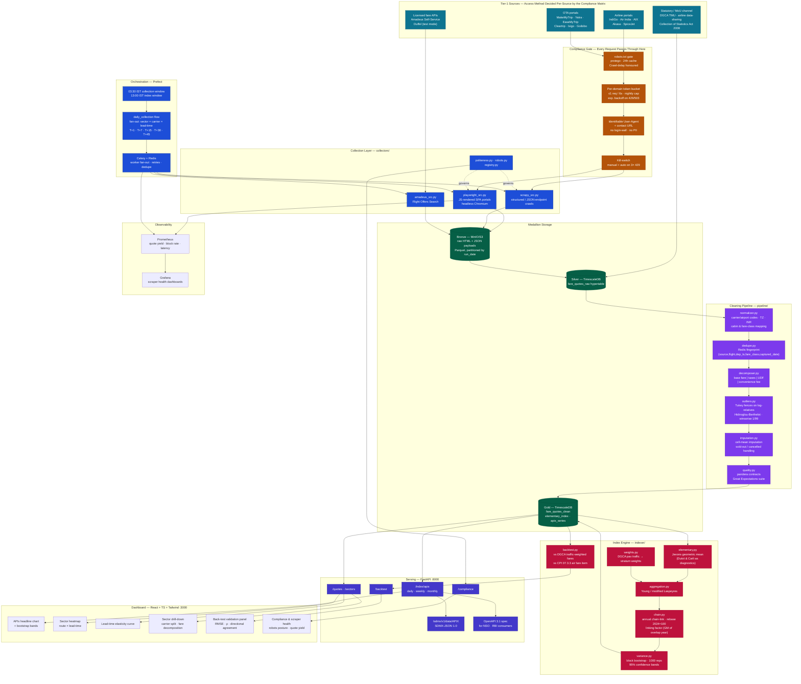
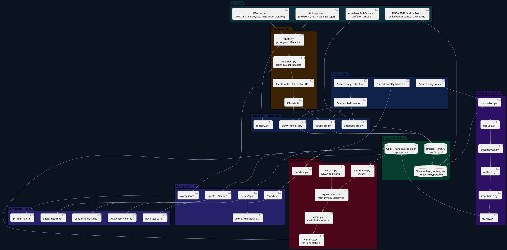

# VIMAAN Architecture Diagram

**VIMAAN** — *Validated Index for Monitoring Airfares, Automated & National*
Publishes **APIx** — the Real-time Airfare Price Index for India.
SIH 2026 · PS 26056 · MoSPI / Data Informatics & Innovation Division (DIID)

---

## 1. Mermaid — Full System (`graph TB`)

Renders in GitHub, Notion, Obsidian and the [Mermaid Live Editor](https://mermaid.live).



---

## 2. Mermaid — Sequence Diagram of One Daily Collection Run

This is the diagram to put on the "how it actually works" slide. It shows the compliance gate as a first-class actor, not an afterthought.

```mermaid
sequenceDiagram
    autonumber
    participant SCH as Prefect Scheduler
    participant REG as collectors/registry.py
    participant ROB as collectors/robots.py
    participant POL as collectors/politeness.py
    participant WRK as Celery Worker (Playwright)
    participant SRC as Source Portal
    participant S3 as MinIO (Bronze)
    participant TS as TimescaleDB
    participant PIP as pipeline/*
    participant IDX as indexer/*
    participant API as FastAPI

    Note over SCH: 03:30 IST — daily_collection flow starts
    SCH->>REG: enumerate active sources × basket
    REG-->>SCH: 20 sectors × 5 lead-times × 6 sources = 600 tasks

    loop per source, before first request of the day
        SCH->>ROB: allowed(source, path)?
        ROB->>SRC: GET /robots.txt (cached 24h)
        SRC-->>ROB: robots.txt
        ROB-->>SCH: ALLOW + Crawl-delay=10s
        Note right of ROB: DISALLOW ⇒ source is demoted<br/>to the licensed-API route<br/>and flagged in /compliance
    end

    SCH->>WRK: dispatch task(sector=DEL-BOM, lead=T+15, source=S3)

    loop per request
        WRK->>POL: acquire token (bucket: 1 req / 6s / domain)
        POL-->>WRK: token granted (or sleep)
        WRK->>SRC: GET search page (identifiable UA + contact URL)
        alt HTTP 200
            SRC-->>WRK: JS-rendered results
            WRK->>WRK: extract offers → RawQuote[]
        else HTTP 429 / 503
            SRC-->>WRK: throttled
            WRK->>POL: exponential backoff (2^n, cap 15 min)
            Note right of POL: 3 consecutive 429s ⇒ kill-switch<br/>trips for that domain for 24h
        end
    end

    WRK->>S3: write raw payload (Parquet, run_date partition)
    WRK->>TS: INSERT fare_quotes_raw (hypertable)

    Note over SCH: 13:00 IST — daily_index flow starts
    SCH->>PIP: normalize → dedupe → decompose → outliers → impute → QC
    PIP->>TS: UPSERT fare_quotes_clean
    PIP-->>SCH: quality report (coverage %, imputation %, outlier %)

    alt coverage ≥ 70% of expected cells
        SCH->>IDX: compute elementary (Jevons) per cell
        IDX->>IDX: aggregate (Young / modified Laspeyres) with DGCA weights
        IDX->>IDX: chain-link, rebase to 2024=100
        IDX->>IDX: block bootstrap → 95% bands
        IDX->>TS: INSERT apix_series (status = PROVISIONAL)
    else coverage < 70%
        IDX->>TS: INSERT apix_series (status = SUPPRESSED)
        Note right of IDX: publication suppressed;<br/>revision policy applies at T+7
    end

    API->>TS: SELECT apix_series
    API-->>API: serve /index/apix and /sdmx/v1/data/APIX
```

---

## 3. PlantUML — Component View

Paste into [plantuml.com/plantuml](https://www.plantuml.com/plantuml/uml/).



---

## 4. ASCII — Deployment Diagram (Docker Compose, single host)

```
┌───────────────────────────────────────────────────────────────────────────────────┐
│  HOST  (8 vCPU / 16 GB RAM / 250 GB SSD — a single MoSPI DIID VM is enough)        │
│                                                                                   │
│  ┌─────────────────────────────────────────────────────────────────────────────┐  │
│  │ docker network: vimaan_net                                                  │  │
│  │                                                                             │  │
│  │  ┌──────────────┐   ┌──────────────────┐   ┌───────────────────────────┐   │  │
│  │  │  nginx       │   │  api             │   │  postgres + timescaledb   │   │  │
│  │  │  :3000       │──▶│  FastAPI :8000   │──▶│  :5432                    │   │  │
│  │  │  SPA + /api  │   │  uvicorn x4      │   │  hypertables:             │   │  │
│  │  │  gzip, cache │   │  OpenAPI 3.1     │   │   fare_quotes_raw         │   │  │
│  │  └──────────────┘   │  SDMX-JSON out   │   │   fare_quotes_clean       │   │  │
│  │         ▲           └──────────────────┘   │  continuous aggregates:   │   │  │
│  │         │                    ▲             │   apix_daily, apix_weekly │   │  │
│  │  ┌──────┴───────┐            │             │   apix_monthly            │   │  │
│  │  │  frontend    │            │             └───────────────────────────┘   │  │
│  │  │  React build │            │                          ▲                   │  │
│  │  │  (static)    │            │                          │                   │  │
│  │  └──────────────┘            │             ┌────────────┴──────────────┐   │  │
│  │                              │             │  worker (Celery)          │   │  │
│  │  ┌───────────────────────┐   │             │  Playwright + Chromium    │   │  │
│  │  │  scheduler (Prefect)  │───┼────────────▶│  concurrency = 4          │   │  │
│  │  │  daily_collection     │   │             │  1 browser ctx / domain   │   │  │
│  │  │  daily_index          │   │             └───────────────────────────┘   │  │
│  │  │  weekly_backtest      │   │                          ▲                   │  │
│  │  └───────────────────────┘   │                          │                   │  │
│  │                              │             ┌────────────┴──────────────┐   │  │
│  │  ┌───────────────────────┐   │             │  redis :6379              │   │  │
│  │  │  minio :9000          │◀──┘             │  broker · token buckets   │   │  │
│  │  │  bronze/ raw parquet  │                 │  quote-fingerprint dedupe │   │  │
│  │  │  + raw HTML evidence  │                 │  robots.txt cache         │   │  │
│  │  └───────────────────────┘                 └───────────────────────────┘   │  │
│  │                                                                             │  │
│  │  ┌───────────────────────┐   ┌───────────────────────┐                     │  │
│  │  │  prometheus :9090     │──▶│  grafana :3001        │                     │  │
│  │  │  scraper + API metrics│   │  scraper health board │                     │  │
│  │  └───────────────────────┘   └───────────────────────┘                     │  │
│  └─────────────────────────────────────────────────────────────────────────────┘  │
│                                                                                   │
│  Volumes:  pgdata (Timescale) · miniodata (bronze) · redisdata                    │
│            pw_cache (Playwright browsers) · grafana_data                          │
│                                                                                   │
│  Egress:   only to the source domains in collectors/registry.py                    │
│            all egress logged; per-domain nightly request cap enforced              │
└───────────────────────────────────────────────────────────────────────────────────┘

                    ▼ consumed by ▼
        ┌──────────────────┬──────────────────┬──────────────────┐
        │  NSO / MoSPI     │  RBI (MPD/DEPR)  │  Public / press  │
        │  SDMX-JSON pull  │  OpenAPI + CSV   │  dashboard + CSV │
        └──────────────────┴──────────────────┴──────────────────┘
```

---

## 5. ASCII — Data Flow Through the Index Math

The one diagram that answers "is this statistically defensible?".

```
  RAW QUOTE  (one row of fare_quotes_raw)
  ──────────────────────────────────────────────────────────────────────────
  captured_at 2026-09-04T03:41Z │ source ixigo │ sector DEL-BOM
  carrier 6E │ flight 6E-2134 │ departure 2026-09-19T06:10 (= T+15)
  cabin ECONOMY │ fare_class SAVER │ total ₹7,412
  ──────────────────────────────────────────────────────────────────────────
                                 │
                                 ▼
  ① NORMALISE  ─ IATA codes, IST→UTC, INR, cabin & fare-class mapping
                                 │
                                 ▼
  ② DECOMPOSE  ─ ₹7,412 = base 5,150 + taxes/fees 1,432 + UDF 236
                            + convenience 594
                 →  the index tracks TOTAL (what the traveller pays)
                    and BASE (the airline's own price signal) in parallel
                                 │
                                 ▼
  ③ CELL ASSIGNMENT — the elementary aggregate
     cell_key = (sector, carrier, lead_bucket, cabin, dep_dow_band)
              = (DEL-BOM, 6E, T+15, ECON, WEEKDAY)
     Constant lead time is what holds quality fixed. We never compare
     "DEL-BOM yesterday" to "DEL-BOM today"; we compare
     "DEL-BOM, 15 days out, weekday, 6E, economy" across days.
                                 │
                                 ▼
  ④ OUTLIER FILTER on log price relatives r_i = ln(p_i,t / p_i,t-1)
     Tukey:  keep r_i ∈ [Q1 − 3·IQR , Q3 + 3·IQR]
     Hidiroglou-Berthelot on the ratio distribution for skewed cells
     Winsorise survivors at the 1st / 99th percentile
                                 │
                                 ▼
  ⑤ IMPUTATION for sold-out / missing cells
     cell-mean imputation:  r̂_i,t = exp( mean over surviving j in cell
                                          of ln(p_j,t / p_j,t-1) )
     NOT carry-forward (p_i,t := p_i,t-1) — see §4 of plan.md
                                 │
                                 ▼
  ⑥ ELEMENTARY INDEX — Jevons (geometric mean of price relatives)
                        n
     I_c(t/t-1)  =  ∏  ( p_i,t / p_i,t-1 ) ^ (1/n)
                       i=1
     Matches MoSPI's own CPI 2024 choice for elementary aggregates.
                                 │
                                 ▼
  ⑦ STRATUM AGGREGATION — Young / modified Laspeyres
     APIx_t / APIx_0  =  Σ_s  w_s · ( I_s,t / I_s,0 )        Σ_s w_s = 1
     w_s from DGCA domestic passenger traffic × lead-time share
     Matches MoSPI's own CPI 2024 choice for higher-level aggregation.
                                 │
                                 ▼
  ⑧ CHAIN-LINK + REBASE to 2024 = 100
     LF = GM(new series, overlap year) / GM(old series, overlap year)
     (the same linking-factor construction MoSPI published for CPI 2024)
                                 │
                                 ▼
  ⑨ VARIANCE — block bootstrap over quotes within cell, 1000 replicates
     → 95% band around every published APIx point
                                 │
                                 ▼
  ⑩ PUBLISH — apix_series (PROVISIONAL → REVISED at T+7 → FROZEN at T+30)
     + /sdmx/v1/data/APIX for NSO/RBI, + dashboard, + CSV
```

---

## 6. How to Render These

```bash
# Mermaid → PNG/SVG
npm i -g @mermaid-js/mermaid-cli
mmdc -i architecture-diagram.md -o architecture.png -w 3200 -H 1800 -b transparent

# Or: paste the mermaid block into https://mermaid.live and export

# PlantUML → PNG
# paste into https://www.plantuml.com/plantuml/uml/
# or: java -jar plantuml.jar architecture.puml

# The ASCII blocks are meant to be screenshotted from a monospace editor
# at ~13pt for the PPT — they render more legibly than a re-drawn box diagram.
```

---

## 7. Diagram Assets Referenced Elsewhere

| Filename | Status | Used in |
|---|---|---|
| `architecture.png` | **not yet generated** — render from §1 | README, PPT slide 11 |
| `implementation-flow.svg` / `.png` | **not yet generated** — see `implementation-flow.md` | PPT slide 5, README |
| `implementation-flow-full.svg` / `.png` | **not yet generated** | appendix / report |
| `sequence-daily-run.png` | **not yet generated** — render from §2 | PPT slide 5 speaker panel |

None of the raster/vector assets exist in this folder yet; all four are reproducible from the source blocks above.
