# VIMAAN — Implementation Flow (PS 26056)

Six hundred noisy fare quotes in, one defensible index number out: a narrowing funnel with a statistician's filter at every gate.

## Slide panel — use this one


Sized for **half a slide** (about 6.5in x 5.5in, 936 x 792 units). Type is set so it stays legible at that size, so the panel carries the flow only — the supporting argument belongs in the text beside it.

- `implementation-flow.svg` — vector, PowerPoint imports SVG natively and it stays sharp
- `implementation-flow.png` — 2808 x 2376 raster, if SVG import is a problem

> **Status:** neither image file exists in this folder yet. The Mermaid source at the bottom of this page is the authoritative version; render it (see *Regenerate*) or hand-draw the SVG panel from it before the deck is built.

## How to read it

Reads top to bottom, and the cards physically narrow as the quote set does. Roughly 3,000 raw offer prices are scraped across 20 sectors × 5 lead-time windows × 6 sources on a single night. Normalisation and fare decomposition turn them into comparable rows; the outlier filter and the sold-out imputation step cut them to a clean panel; the Jevons elementary index collapses each cell to one price relative; the weighted aggregation collapses ~600 cells to one number. **One number comes out, and it carries a confidence band.**

The right-hand pills carry the numbers that show statistical judgement rather than "we scraped a website": `~3,000 quotes → ~600 cells`, `~600 cells → 1 index point`, `95% band on every point`, and `offer price ≠ transaction price — and we say so` on the caveat row.

The single most important idea on the panel is the **constant-lead-time cell**. Every arrow into `Cell assignment` is the answer to the hardest methodological objection in this problem statement: an airfare is not a fixed product, so you cannot price "DEL-BOM" the way you price a kilo of rice. You price *DEL-BOM, departing exactly 15 days from today, weekday, IndiGo, economy* — and that cell is comparable across days.

## Stage notes

| On the panel | In the code | What it actually does |
|---|---|---|
| Sources (5 airlines + 6 OTAs + APIs) | `app/collectors/registry.py` | per-source access method resolved from the compliance matrix |
| Compliance gate | `app/collectors/robots.py`, `app/collectors/politeness.py` | robots.txt + `Crawl-delay`, token bucket, backoff, kill-switch |
| Collect | `app/collectors/playwright_src.py`, `scrapy_src.py`, `amadeus_src.py` | fan-out over sector × lead-time × source |
| Land raw | `app/pipeline/landing.py` | Bronze Parquet on MinIO → `fare_quotes_raw` hypertable |
| Normalise | `app/pipeline/normalizer.py` | IATA codes, IST→UTC, INR, cabin & fare-class mapping |
| De-duplicate | `app/pipeline/dedupe.py` | Redis fingerprint on `(source, flight_no, departure_ts, fare_class, capture_date)` |
| Decompose fare | `app/pipeline/decomposer.py` | base · taxes/fees · UDF · convenience charge |
| Outlier filter | `app/pipeline/outliers.py` | Tukey fences on log-relatives, Hidiroglou-Berthelot, winsorise 1/99 |
| Impute sold-out | `app/pipeline/imputation.py` | cell-mean imputation of the price relative (never carry-forward) |
| Quality contracts | `app/pipeline/quality.py` | `pandera` schema + Great Expectations suite; gates publication |
| Cell assignment | `app/indexer/elementary.py` | `(sector, carrier, lead_bucket, cabin, dep_dow_band)` |
| Jevons elementary index | `app/indexer/elementary.py` | geometric mean of price relatives per cell |
| Weights | `app/indexer/weights.py` | DGCA domestic passenger traffic → stratum weights |
| Weighted aggregation | `app/indexer/aggregation.py` | Young / modified Laspeyres across strata |
| Chain-link + rebase | `app/indexer/chain.py` | annual chain, linking factor, rebase to 2024=100 |
| Confidence band | `app/indexer/variance.py` | block bootstrap, 1000 replicates |
| Back-test | `app/indexer/backtest.py` | vs DGCA traffic data and CPI 07.3.3 air fare item |
| Publish | `app/routers/index.py`, `app/routers/sdmx.py` | REST + SDMX-JSON, `PROVISIONAL → REVISED → FROZEN` |

## Other variants

- `implementation-flow-full.svg` / `.png` — the full-slide version (16:9, 3200 x 1800) with the supporting evidence panels: the compliance matrix strip, the back-test scatter, and the formula box. Good for a dedicated slide, the report, or the appendix.
- `implementation-flow-mermaid.mmd` — plain Mermaid, rendered inline below.
- `implementation-flow-detailed.mmd` / `.png` — Mermaid with every branch broken out (per-source access paths, the suppression branch, the revision loop).

*(None of these variants exist as files yet — they are the intended asset set, matching the layout used for PS 26099.)*

## Regenerate

Edit the SVG, then re-render the PNG with headless Chrome:

```bash
chrome --headless --disable-gpu --force-device-scale-factor=3 --window-size=936,792 \
  --screenshot=implementation-flow.png implementation-flow.svg
```

Or render straight from the Mermaid source:

```bash
npm i -g @mermaid-js/mermaid-cli
mmdc -i implementation-flow-mermaid.mmd -o implementation-flow.png -w 2808 -H 2376 -b transparent
```

## Mermaid source

```mermaid
flowchart TD
    subgraph SOURCES[" Sources — access method per compliance matrix "]
        direction LR
        S1["Airline portals<br/>6E · AI · IX · QP · SG"]
        S2["OTA portals<br/>MMT · Yatra · EMT · Cleartrip · Ixigo"]
        S3["Licensed APIs<br/>Amadeus · Duffel"]
    end

    GATE["Compliance gate — robots.txt · Crawl-delay · token bucket<br/>identifiable UA · no login-wall · no PII · kill-switch"]

    COLLECT["Collect — 20 sectors × 5 lead windows (T+1 · T+7 · T+15 · T+30 · T+45)<br/>≈ 3,000 offer prices / night"]

    RAW[("Bronze — raw Parquet + fare_quotes_raw")]

    subgraph CLEAN[" Clean "]
        direction LR
        C1["Normalise<br/>codes · TZ · INR"]
        C2["De-duplicate<br/>Redis fingerprint"]
        C3["Decompose<br/>base | tax | UDF | conv."]
    end

    subgraph FILTER[" Filter & repair "]
        direction LR
        F1["Outliers<br/>Tukey on log-relatives<br/>Hidiroglou-Berthelot"]
        F2["Sold-out / missing<br/>cell-mean imputation"]
        F3["Quality contracts<br/>pandera · GE"]
    end

    CELL["Cell assignment — the constant-lead-time trick<br/>(sector, carrier, lead_bucket, cabin, dep_dow_band)<br/>≈ 600 elementary cells"]

    JEV["Jevons elementary index per cell<br/>I = ∏ (p_t / p_t-1)^(1/n)"]

    WT["DGCA passenger traffic → stratum weights w_s"]

    AGG["Young / modified Laspeyres aggregation<br/>APIx_t = Σ w_s · (I_s,t / I_s,0)"]

    CHN["Chain-link + rebase to 2024 = 100<br/>linking factor = GM(new) / GM(old) over overlap year"]

    VAR["Block bootstrap → 95% confidence band"]

    GATE2{"Coverage ≥ 70%<br/>of expected cells?"}

    SUP["SUPPRESS this day<br/>flag + revise at T+7"]

    PUB["Publish APIx<br/>daily · weekly · monthly<br/>PROVISIONAL → REVISED → FROZEN"]

    OUT["Dashboard · REST API · SDMX-JSON for NSO & RBI"]

    BT["Back-test — vs DGCA traffic-weighted fares<br/>vs CPI 07.3.3 air fare item (eSankhyiki)<br/>RMSE · Pearson ρ · directional agreement · ≥30 days"]

    S1 --> GATE
    S2 --> GATE
    S3 --> COLLECT
    GATE --> COLLECT
    COLLECT --> RAW
    RAW --> C1 --> C2 --> C3
    C3 --> F1 --> F2 --> F3
    F3 --> CELL
    CELL --> JEV
    JEV --> AGG
    WT --> AGG
    AGG --> CHN --> VAR --> GATE2
    GATE2 -->|no| SUP
    SUP -.revision loop.-> GATE2
    GATE2 -->|yes| PUB
    PUB --> OUT
    PUB --> BT
    BT -.calibration feedback.-> WT

    classDef src fill:#cfe2f3,stroke:#6fa8dc,color:#1f2937;
    classDef gate fill:#fce5cd,stroke:#e69138,color:#1f2937;
    classDef coll fill:#e8dfc8,stroke:#bfa76a,color:#1f2937;
    classDef clean fill:#d9ead3,stroke:#8fbc8f,color:#1f2937;
    classDef filt fill:#f4cccc,stroke:#cc6666,color:#1f2937;
    classDef idx fill:#b4a7d6,stroke:#7b68a6,color:#1f2937;
    classDef act fill:#e6e6e6,stroke:#999999,color:#1f2937;

    class S1,S2,S3 src;
    class GATE,GATE2 gate;
    class COLLECT,RAW coll;
    class C1,C2,C3 clean;
    class F1,F2,F3 filt;
    class CELL,JEV,WT,AGG,CHN,VAR idx;
    class SUP,PUB,OUT,BT act;

    style SOURCES fill:#f4f4f4,stroke:#d0d0d0,color:#1f2937;
    style CLEAN fill:#f4f4f4,stroke:#d0d0d0,color:#1f2937;
    style FILTER fill:#f4f4f4,stroke:#d0d0d0,color:#1f2937;
```


