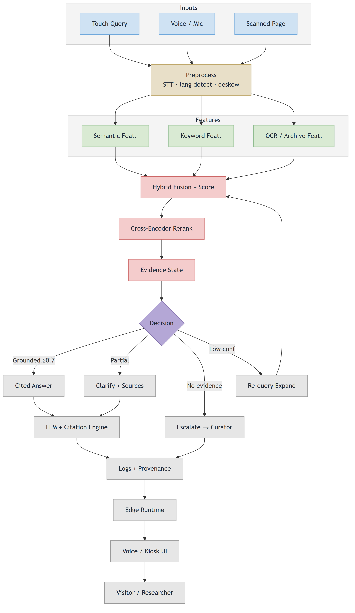
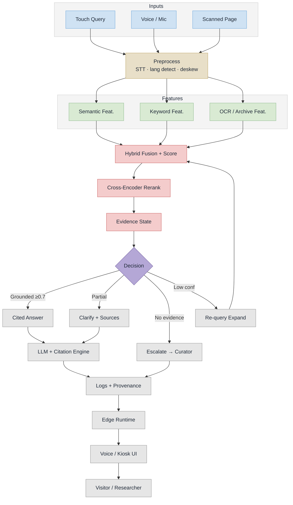

# Samdarshi — Implementation Flow (PS 26096)

> Renders on GitHub / Mermaid Live. PNG + SVG regenerate with:
> `npx -y @mermaid-js/mermaid-cli@11 -i implementation-flow.mmd -o implementation-flow.png -b white -s 3`

## Stage notes

| Stage | What runs | Reference |
|---|---|---|
| Inputs | kiosk touch query, mic voice query, scanned manuscript page | Master Plan §5.1 |
| Preprocess | Whisper.cpp STT, language/script detection (EN/HI/MR/SA), deskew + denoise + binarize for scans | Master Plan §5.2 step 1, §5.3 |
| Semantic Feat. | sentence-transformers embeddings, pgvector similarity search | Master Plan §5.2 step 2 |
| Keyword Feat. | Meilisearch full-text search for exact terms and names | Master Plan §5.2 step 2 |
| OCR / Archive Feat. | Tesseract 5 + EasyOCR text, layout and metadata, chunked and embedded back into the index | Master Plan §5.3 |
| Hybrid Fusion + Score | Reciprocal Rank Fusion over semantic + keyword hits, top-10 | Master Plan §5.2 step 2 |
| Cross-Encoder Rerank | top-10 → top-5, relevance filter > 0.7 | Master Plan §5.2 step 3 |
| Evidence State | how much verified archive evidence backs the query | — |
| Decision | grounded → cited answer; partial → clarify + offer sources; no evidence → curator escalation instead of a guess; low confidence → query expansion loop | anti-hallucination guarantee |
| LLM + Citation Engine | Llama 3 8B via Ollama, temperature 0.3, streaming, citations formatted as `[Book, p.NN]` | Master Plan §5.2 steps 4-6 |
| Logs + Provenance | query analytics, source links back to the original scan | Master Plan §5.2 step 6 |
| Edge Runtime | on-prem AI server + Raspberry Pi kiosk, fully offline | Master Plan §4 |
| Voice / Kiosk UI | Coqui / Indic TTS narration, touch UI, waveform + playback controls | Master Plan §5.4 |

## Source

