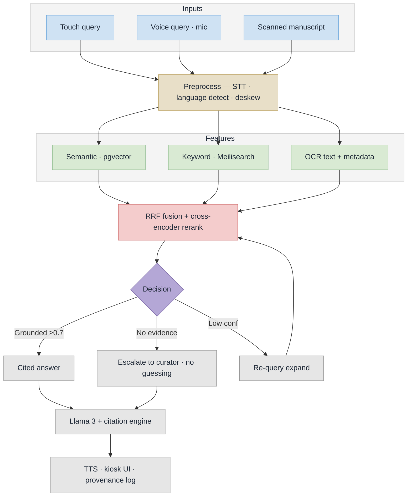

# Samdarshi — Implementation Flow (PS 26096)

## Slide version (use this one in the PPT)


Twelve nodes, near-square, readable at slide size. Vector copy: [`implementation-flow.svg`](implementation-flow.svg).

## Stage notes

| Stage | What runs | Reference |
|---|---|---|
| Inputs | kiosk touch query, mic voice query, scanned manuscript page | Master Plan 5.1 |
| Preprocess | Whisper.cpp STT, language/script detection (EN/HI/MR/SA), deskew + denoise + binarize for scans | Master Plan 5.2 step 1, 5.3 |
| Semantic | sentence-transformers embeddings, pgvector similarity search | Master Plan 5.2 step 2 |
| Keyword | Meilisearch full-text search for exact terms and names | Master Plan 5.2 step 2 |
| OCR text + metadata | Tesseract 5 + EasyOCR output, chunked and embedded back into the index | Master Plan 5.3 |
| RRF fusion + rerank | Reciprocal Rank Fusion over semantic + keyword hits (top-10), cross-encoder to top-5 at relevance > 0.7 | Master Plan 5.2 steps 2-3 |
| Decision | grounded -> cited answer; no evidence -> curator escalation instead of a guess; low confidence -> query expansion loop | anti-hallucination guarantee |
| Llama 3 + citation engine | Llama 3 8B via Ollama, temperature 0.3, streaming, citations formatted as `[Book, p.NN]` | Master Plan 5.2 steps 4-6 |
| TTS / kiosk UI / provenance | Coqui + Indic TTS narration, touch UI with playback controls, query log with source links back to the original scan | Master Plan 5.2 step 6, 5.4 |

## Detailed version

The full-fidelity chart with every branch broken out lives in [`implementation-flow-detailed.png`](implementation-flow-detailed.png) (source: [`implementation-flow-detailed.mmd`](implementation-flow-detailed.mmd)). It is roughly 1:2 portrait, so it suits an appendix slide or the report rather than a main slide.

## Regenerate

```bash
npx -y @mermaid-js/mermaid-cli@11 -i implementation-flow.mmd -o implementation-flow.png -b white -s 3
```

## Source


