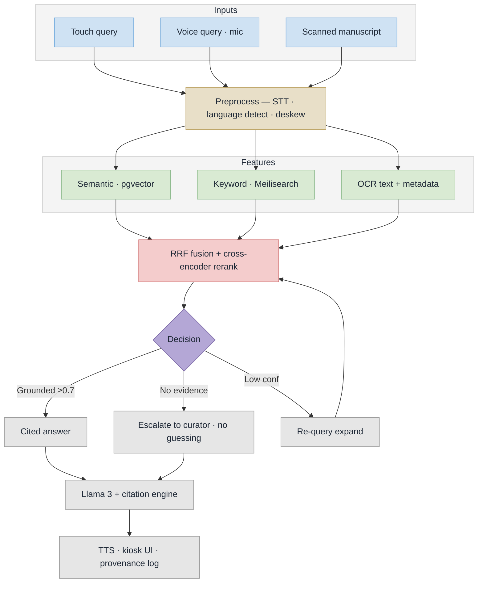

# Samdarshi — Implementation Flow (PS 26096)

Digitisation feeds one verified archive; the kiosk may only speak from it, or it refuses.

## Slide panel — use this one


Sized for **half a slide** (about 6.5in x 5.5in, 936 x 792 units). Type is set so it stays legible at that size, so the panel carries the flow only — the supporting argument belongs in the text beside it.

- `implementation-flow.svg` — vector, PowerPoint imports SVG natively and it stays sharp
- `implementation-flow.png` — 2808 x 2376 raster, if SVG import is a problem

## How to read it

Two movements in one panel. Across the top, how the archive grows: scan, restore, OCR, curator verification. In the middle, the verified archive itself — if it is not in here, the kiosk will not say it. Down the spine, how one question is answered: speech or touch, retrieval and re-ranking, then the gate.

The gate is the point of the slide. Evidence found, and Llama 3 answers with a citation per claim. No evidence, and it says so and routes the question to the curator queue instead of inventing an answer — and the dashed line on the left carries that unanswered question back to the top as a digitisation request.

## Stage notes

| On the panel | Reference |
|---|---|
| Scan / restore / OCR | Master Plan 5.3 |
| Curator verifies | nothing enters the archive unverified |
| Retrieve, then re-rank | Master Plan 5.2 steps 2-3 |
| Evidence gate | anti-hallucination guarantee |
| Speak it back | Master Plan 5.4 |

## Other variants

- `implementation-flow-full.svg` / `.png` — the full-slide version (16:9, 3200 x 1800) with the supporting evidence panels. Good for a dedicated slide, the report, or the appendix.
- `implementation-flow-mermaid.mmd` — plain Mermaid, rendered inline below.
- `implementation-flow-detailed.mmd` / `.png` — Mermaid with every branch broken out.

## Regenerate

Edit the SVG, then re-render the PNG with headless Chrome:

```bash
chrome --headless --disable-gpu --force-device-scale-factor=3 --window-size=936,792 \n  --screenshot=implementation-flow.png implementation-flow.svg
```

## Mermaid source


