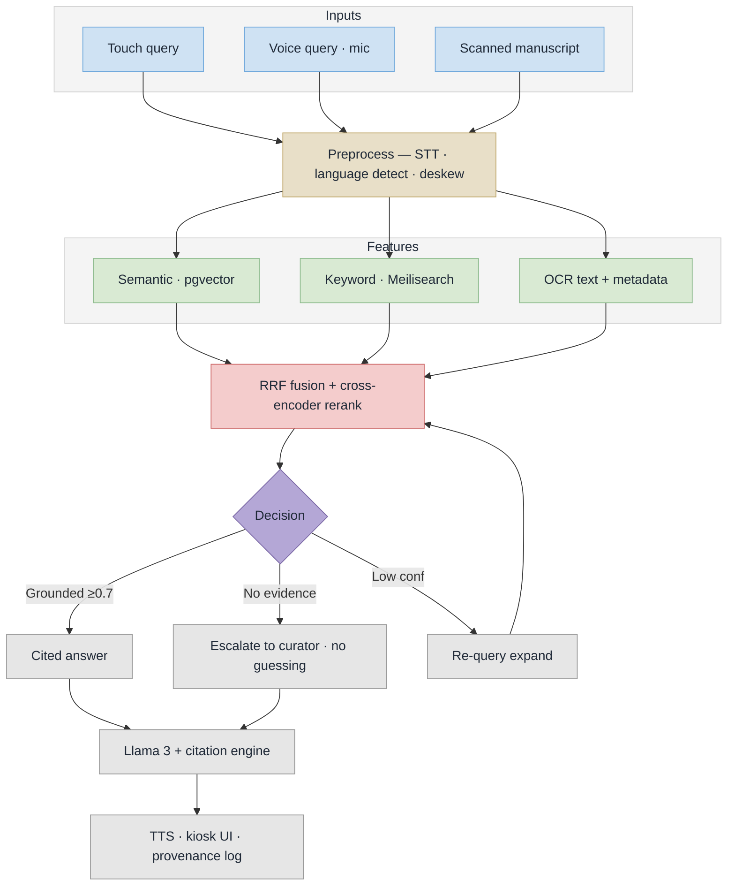

# Samdarshi — Implementation Flow (PS 26096)

Two lanes around one verified archive: digitisation feeds it, the kiosk may only speak from it.


Slide-ready: `implementation-flow.svg` (vector — PowerPoint imports SVG natively and it stays sharp at any size) and `implementation-flow.png` (3200x1800, 16:9, drops straight onto a slide).

## How to read it

**Left lane — how the archive grows.** Capture, restore, OCR, curator verification, indexing. A scanned page is useless until it is searchable, and nothing enters unverified.

**Centre — the verified archive.** Page images, text and metadata, embeddings, keyword index. The single source of truth: if it is not in here, the kiosk will not say it.

**Right lane — how one question is answered.** Speech or touch, hybrid retrieval, re-ranking, then the gate: evidence, or an honest refusal. The refusal is the hero of the diagram — a memorial kiosk that invents quotations is a liability, and refusing well is what separates this from a chatbot.

**The dashed loop.** Every unanswered question becomes a digitisation request, so the archive learns what visitors actually ask for.

**The kiosk mock.** A real answer with real citations and a language switcher — the visual anchor for the demo.

## Stage notes

| On the diagram | Reference |
|---|---|
| Capture / restore / read | Master Plan 5.3 (OCR pipeline) |
| Curator verifies | archival-science requirement, not an afterthought |
| Index (512-token chunks + embeddings) | Master Plan 5.3, indexing stage |
| Retrieve + RRF fusion | Master Plan 5.2 step 2 |
| Re-rank, relevance > 0.7 | Master Plan 5.2 step 3 |
| Evidence gate | anti-hallucination guarantee |
| Llama 3 + citations | Master Plan 5.2 steps 4-6 |
| TTS in four languages | Master Plan 5.4 |

## Regenerate

Edit the SVG by hand, then re-render the PNG with headless Chrome:

```bash
chrome --headless --disable-gpu --force-device-scale-factor=2 --window-size=1600,900 \n  --screenshot=implementation-flow.png implementation-flow.svg
```

## Plain Mermaid variants

Kept for GitHub inline rendering and for anyone who wants a boxes-and-arrows version:
`implementation-flow-mermaid.mmd` (compact) and `implementation-flow-detailed.mmd` / `.png` (every branch broken out).


