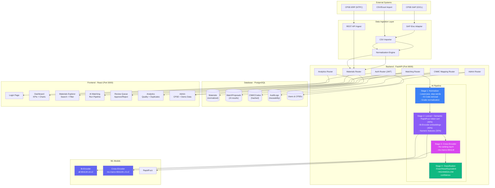
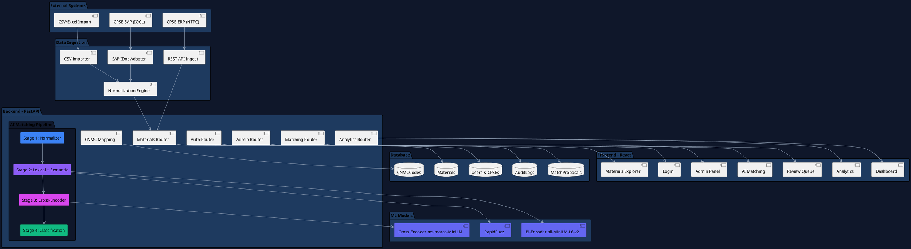

# CodeOne Architecture Diagram

## Mermaid Diagram (renders in GitHub, Notion, Mermaid Live Editor)



---

## PlantUML Diagram



---

## Graphviz DOT Format

```dot
digraph CodeOne {
    rankdir=TB;
    node [shape=box, style="rounded,filled", fontname="Arial", fontsize=11];
    edge [arrowhead=vee, color="#475569"];

    subgraph cluster_external {
        label="External Systems";
        style=filled; color="#1e293b"; fontcolor="#e2e8f0";
        SAP1 [label="CPSE-SAP (IOCL)", fillcolor="#334155", fontcolor="white"];
        SAP2 [label="CPSE-ERP (NTPC)", fillcolor="#334155", fontcolor="white"];
        CSV [label="CSV/Excel Import", fillcolor="#334155", fontcolor="white"];
    }

    subgraph cluster_ingestion {
        label="Data Ingestion Layer";
        style=filled; color="#1e293b"; fontcolor="#e2e8f0";
        IDOC [label="SAP IDoc Adapter", fillcolor="#334155", fontcolor="white"];
        REST [label="REST API Ingest", fillcolor="#334155", fontcolor="white"];
        IMPORT [label="CSV Importer", fillcolor="#334155", fontcolor="white"];
        NORM [label="Normalization Engine", fillcolor="#3b82f6", fontcolor="white"];
    }

    subgraph cluster_backend {
        label="Backend - FastAPI :8000";
        style=filled; color="#1e293b"; fontcolor="#e2e8f0";
        AUTH [label="Auth (JWT)", fillcolor="#334155", fontcolor="white"];
        MAT [label="Materials Router", fillcolor="#334155", fontcolor="white"];
        MATCH [label="Matching Router", fillcolor="#334155", fontcolor="white"];
        MAP [label="CNMC Mapping", fillcolor="#334155", fontcolor="white"];
        ANL [label="Analytics Router", fillcolor="#334155", fontcolor="white"];
        ADM [label="Admin Router", fillcolor="#334155", fontcolor="white"];
        S1 [label="Stage 1 Normalizer", fillcolor="#3b82f6", fontcolor="white", shape=ellipse];
        S2 [label="Stage 2 Lexical+Semantic", fillcolor="#8b5cf6", fontcolor="white", shape=ellipse];
        S3 [label="Stage 3 Cross-Encoder", fillcolor="#d946ef", fontcolor="white", shape=ellipse];
        S4 [label="Stage 4 Classification", fillcolor="#10b981", fontcolor="white", shape=ellipse];
        S1 -> S2 -> S3 -> S4;
    }

    subgraph cluster_ml {
        label="ML Models";
        style=filled; color="#1e293b"; fontcolor="#e2e8f0";
        BI [label="Bi-Encoder", fillcolor="#6366f1", fontcolor="white"];
        CE [label="Cross-Encoder", fillcolor="#6366f1", fontcolor="white"];
        FUZZ [label="RapidFuzz", fillcolor="#6366f1", fontcolor="white"];
    }

    subgraph cluster_db {
        label="Database (PostgreSQL)";
        style=filled; color="#1e293b"; fontcolor="#e2e8f0";
        MAT_DB [label="Materials", shape=cylinder, fillcolor="#1e3a8a", fontcolor="white"];
        MATCH_DB [label="MatchProposals", shape=cylinder, fillcolor="#1e3a8a", fontcolor="white"];
        CNMC_DB [label="CNMCCodes", shape=cylinder, fillcolor="#1e3a8a", fontcolor="white"];
        AUDIT_DB [label="AuditLogs", shape=cylinder, fillcolor="#1e3a8a", fontcolor="white"];
    }

    subgraph cluster_frontend {
        label="Frontend - React :3000";
        style=filled; color="#1e293b"; fontcolor="#e2e8f0";
        LOGIN [label="Login", fillcolor="#334155", fontcolor="white"];
        DASH [label="Dashboard", fillcolor="#334155", fontcolor="white"];
        MAT_P [label="Materials", fillcolor="#334155", fontcolor="white"];
        MATCH_P [label="AI Matching", fillcolor="#334155", fontcolor="white"];
        REVIEW [label="Review Queue", fillcolor="#334155", fontcolor="white"];
        ANL_P [label="Analytics", fillcolor="#334155", fontcolor="white"];
        ADMIN_P [label="Admin", fillcolor="#334155", fontcolor="white"];
    }

    SAP1 -> IDOC; SAP2 -> REST; CSV -> IMPORT;
    IDOC -> NORM; IMPORT -> NORM;
    NORM -> MAT; REST -> MAT;
    MAT -> MAT_DB; MATCH -> MATCH_DB; MAP -> CNMC_DB; ADM -> AUDIT_DB;
    S2 -> BI; S2 -> FUZZ; S3 -> CE;
    AUTH -> LOGIN; MAT -> MAT_P; MATCH -> MATCH_P; MATCH -> REVIEW;
    ANL -> DASH; ANL -> ANL_P; ADM -> ADMIN_P;
}
```



---

## Python Script to Generate PNG

Save as `docs/generate_diagram.py` and run:

```bash
pip install matplotlib
python docs/generate_diagram.py
```

```python
"""Generate CodeOne architecture diagram as PNG."""

import matplotlib.pyplot as plt
from matplotlib.patches import FancyBboxPatch

COLORS = {
    'bg': '#0f172a', 'box': '#1e3a5f', 'external': '#334155',
    'ai1': '#3b82f6', 'ai2': '#8b5cf6', 'ai3': '#d946ef', 'ai4': '#10b981',
    'ml': '#6366f1', 'db': '#1e3a8a',
    'text': '#e2e8f0', 'subtext': '#94a3b8',
    'arrow': '#475569', 'accent': '#d946ef',
}

def box(ax, x, y, w, h, text, sub='', color='#1e3a5f', text_color='white'):
    b = FancyBboxPatch((x - w/2, y - h/2), w, h,
                      boxstyle="round,pad=0.02,rounding_size=0.15",
                      facecolor=color, edgecolor='#475569', linewidth=1.5, alpha=0.95)
    ax.add_patch(b)
    if sub:
        ax.text(x, y + 0.03, text, ha='center', va='center', fontsize=8.5, fontweight='bold', color=text_color)
        ax.text(x, y - 0.03, sub, ha='center', va='center', fontsize=7, color=COLORS['subtext'])
    else:
        ax.text(x, y, text, ha='center', va='center', fontsize=9, fontweight='bold', color=text_color)

def arrow(ax, x1, y1, x2, y2):
    ax.annotate('', xy=(x2, y2), xytext=(x1, y1),
                arrowprops=dict(arrowstyle='->', color=COLORS['arrow'], lw=1.2))

fig, ax = plt.subplots(figsize=(20, 13))
fig.patch.set_facecolor(COLORS['bg'])
ax.set_facecolor(COLORS['bg'])
ax.set_xlim(-10, 10); ax.set_ylim(-6, 7); ax.axis('off')

# Title
ax.text(0, 6.5, 'CodeOne - System Architecture', ha='center', fontsize=20, fontweight='bold', color='white')
ax.text(0, 6.1, 'AI-Driven National Unified Material Master Framework', ha='center', fontsize=12, color=COLORS['subtext'])

# External
for i, (lbl, sub, x) in enumerate([('CPSE-SAP (IOCL)', 'SAP IDocs', -6), ('CPSE-ERP (NTPC)', 'REST API', 0), ('CSV/Excel Import', 'Manual', 6)]):
    box(ax, x, 5, 2.5, 0.8, lbl, sub, COLORS['external'])

# Ingestion
for i, (lbl, x) in enumerate([('SAP IDoc Adapter', -6), ('REST Ingest', 0), ('CSV Importer', 6)]):
    box(ax, x, 3.5, 2.5, 0.7, lbl, '', COLORS['external'])

# Normalizer
box(ax, 0, 2.3, 5, 0.7, 'Normalization Engine', 'IS codes · Grades · UOMs', COLORS['ai1'])

# Backend APIs
for i, (lbl, sub, x) in enumerate([('Auth', 'JWT', -7), ('Materials', 'CRUD', -4.5), ('Matching', 'AI Engine', -2), ('CNMC', 'Codes', 0.5), ('Analytics', 'Charts', 3), ('Admin', 'CPSE', 5.5)]):
    box(ax, x, 1, 2.2, 0.5, lbl, sub, COLORS['external'])

# AI Pipeline
for i, (lbl, color, x) in enumerate([
    ('Stage 1: Normalizer', COLORS['ai1'], -4.5),
    ('Stage 2: Lexical + Semantic', COLORS['ai2'], -1.5),
    ('Stage 3: Cross-Encoder', COLORS['ai3'], 1.5),
    ('Stage 4: Classification', COLORS['ai4'], 4.5),
]):
    box(ax, x, -0.5, 2.5, 0.7, lbl, '', color)

for i in range(3):
    arrow(ax, -4.5 + i * 3 + 1.25, -0.5, -4.5 + (i+1) * 3 - 1.25, -0.5)

# ML Models
box(ax, 8, 1, 3.5, 4.5, '', '', COLORS['external'])
box(ax, 8, 2.5, 3, 0.5, 'Bi-Encoder', 'all-MiniLM-L6-v2', COLORS['ml'])
box(ax, 8, 1.5, 3, 0.5, 'Cross-Encoder', 'ms-marco-MiniLM', COLORS['ml'])
box(ax, 8, 0.5, 3, 0.5, 'RapidFuzz', 'Lexical similarity', COLORS['ml'])
box(ax, 8, -0.5, 3, 0.5, 'Scikit-learn', 'Numeric features', COLORS['ml'])
arrow(ax, -1.5, -0.85, 6.5, 2.5)
arrow(ax, 1.5, -0.85, 6.5, 1.5)
arrow(ax, -4.5, -0.85, 6.5, 0.5)

# Database
box(ax, 0, -2.3, 8, 1.2, 'PostgreSQL Database', '', COLORS['external'])
for i, (lbl, sub) in enumerate([('Materials', 'Normalized'), ('MatchProposals', 'AI results'), ('CNMCCodes', 'Hashed'), ('AuditLogs', 'Traceability'), ('Users', 'Auth')]):
    box(ax, -3.5 + i * 1.75, -2.3, 1.5, 0.5, lbl, sub, COLORS['db'])

# Frontend
box(ax, 0, -4.2, 9, 1.4, 'Frontend - React + TypeScript + Tailwind', '', COLORS['external'])
for i, (lbl, sub) in enumerate([('Login', 'JWT'), ('Dashboard', 'KPIs'), ('Materials', 'Explorer'), ('Matching', 'AI'), ('Review', 'Queue'), ('Analytics', 'Charts'), ('Admin', 'CPSE')]):
    box(ax, -4 + i * 1.33, -4.2, 1.1, 0.5, lbl, sub, COLORS['box'])

# Connections
arrow(ax, -6, 4.6, -6, 3.85)
arrow(ax, 0, 4.6, 0, 3.85)
arrow(ax, 6, 4.6, 6, 3.85)
arrow(ax, -6, 3.15, -2, 2.65)
arrow(ax, 0, 3.15, 0, 2.65)
arrow(ax, 6, 3.15, 2, 2.65)
arrow(ax, 0, 1.95, -7, 1.3)
arrow(ax, 0, 1.95, -4.5, 1.3)
arrow(ax, 0, 1.95, -2, 1.3)
arrow(ax, 0, 1.95, 0.5, 1.3)
arrow(ax, 0, 1.95, 3, 1.3)
arrow(ax, 0, 1.95, 5.5, 1.3)
for x in [-3.5, -1.75, 0, 1.75, 3.5]:
    arrow(ax, x, -0.15, x, -1.7)
for x in [-4, -2.67, -1.33, 0, 1.33, 2.67, 4]:
    arrow(ax, x, -3.5, x, -3.95)

# Docker footer
ax.text(0, -5.7, 'Docker Compose: docker-compose up --build', ha='center',
        fontsize=11, color=COLORS['accent'], fontweight='bold',
        bbox=dict(boxstyle='round,pad=0.5', facecolor=COLORS['box'], edgecolor=COLORS['accent']))

plt.tight_layout()
plt.savefig('docs/architecture.png', dpi=150, bbox_inches='tight', facecolor=COLORS['bg'])
print("Saved: docs/architecture.png")
```

---

## How to Generate the PNG

```bash
# Option 1: Python script
pip install matplotlib
python docs/generate_diagram.py

# Option 2: Use Mermaid Live Editor
# Visit https://mermaid.live → paste Mermaid code → export as PNG

# Option 3: Use PlantUML
# Visit https://www.plantuml.com/plantuml/uml/ → paste PlantUML → export

# Option 4: Use Graphviz
# Install: apt install graphviz (Linux) or brew install graphviz (Mac)
# Run: dot -Tpng architecture.dot -o architecture.png
```
