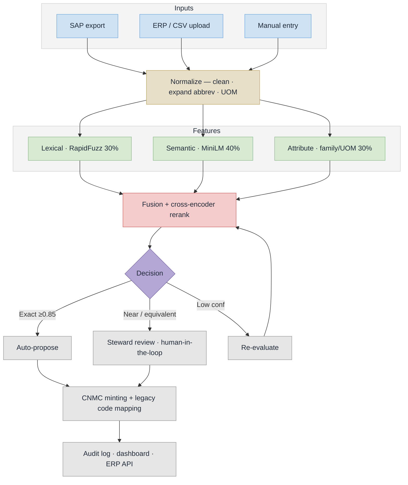

# CodeOne — Implementation Flow (PS 26099)

Four CPSE codes in, one national code out: a narrowing funnel with a human steward at the gate.

## Slide panel — use this one


Sized for **half a slide** (about 6.5in x 5.5in, 936 x 792 units). Type is set so it stays legible at that size, so the panel carries the flow only — the supporting argument belongs in the text beside it.

- `implementation-flow.svg` — vector, PowerPoint imports SVG natively and it stays sharp
- `implementation-flow.png` — 2808 x 2376 raster, if SVG import is a problem

## How to read it

Reads top to bottom, and the cards physically narrow as the candidate set does: four material masters describing the same SKF 6205 bearing enter, normalisation and retrieval and scoring and re-ranking cut 5 billion possible pairs to one verdict, a steward approves, and one CNMC golden record comes out with all four legacy codes still mapped to it.

The right-hand pills carry the numbers that show engineering judgement rather than "we called an API": `5 B -> 50`, `50 -> 5`, `5 -> 1`, and `nothing goes live unreviewed` on the steward row.

## Stage notes

| On the panel | In the code |
|---|---|
| Normalise | `app/services/normalizer.py` |
| Retrieve | `app/ml/embeddings.py` |
| Score (lexical 30 · semantic 40 · attribute 30) | `app/services/matching_engine.py` |
| Re-rank | `app/ml/reranker.py` |
| Steward approves | `app/routers/matching.py` |
| CNMC + legacy mapping | `app/services/cnmc_generator.py`, `app/routers/mapping.py` |

## Other variants

- `implementation-flow-full.svg` / `.png` — the full-slide version (16:9, 3200 x 1800) with the supporting evidence panels. Good for a dedicated slide, the report, or the appendix.
- `implementation-flow-mermaid.mmd` — plain Mermaid, rendered inline below.
- `implementation-flow-detailed.mmd` / `.png` — Mermaid with every branch broken out.

## Regenerate

Edit the SVG, then re-render the PNG with headless Chrome:

```bash
chrome --headless --disable-gpu --force-device-scale-factor=3 --window-size=936,792 \n  --screenshot=implementation-flow.png implementation-flow.svg
```

## Mermaid source


