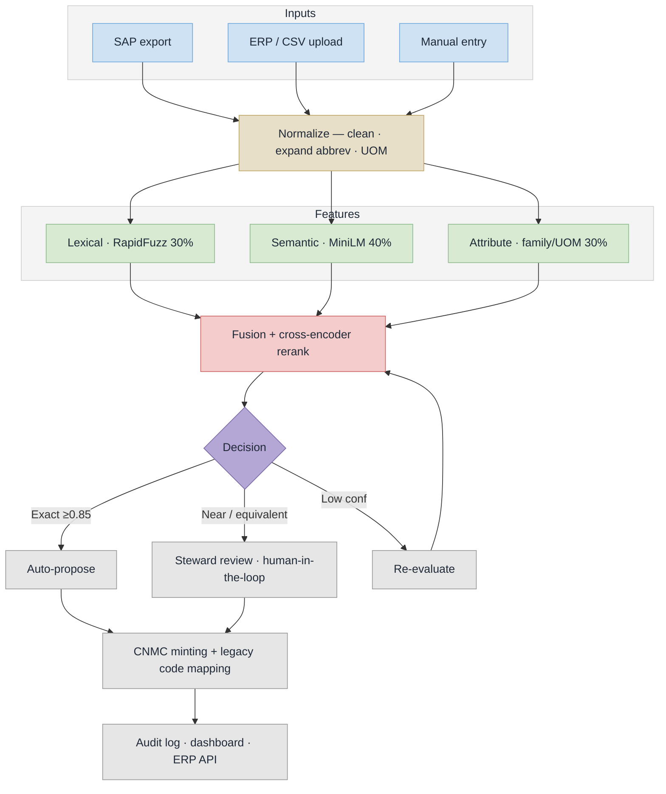

# NUMMF — Implementation Flow (PS 26099)

## Slide version (use this one in the PPT)


Twelve nodes, near-square, readable at slide size. Vector copy: [`implementation-flow.svg`](implementation-flow.svg).

## Stage notes

| Stage | What runs | Where in code |
|---|---|---|
| Inputs | SAP/ERP export, CSV upload, manual entry | `app/routers/materials.py`, `app/routers/admin.py` |
| Normalize | lowercase, IS-code strip, grade + UOM normalization, abbreviation expansion | `app/services/normalizer.py` |
| Lexical 30% | RapidFuzz `token_sort_ratio` | `app/services/matching_engine.py` |
| Semantic 40% | bi-encoder `all-MiniLM-L6-v2` cosine similarity | `app/ml/embeddings.py` |
| Attribute 30% | family / material type / UOM compatibility | `app/services/matching_engine.py` |
| Fusion + rerank | blended score at threshold 0.65, top-K shortlist, then `ms-marco-MiniLM-L-6-v2` cross-encoder (sigmoid-normalized, blended 0.6/0.4) | `_candidate_selection`, `app/ml/reranker.py` |
| Decision | exact >=0.85 auto-propose, near/equivalent >=0.65 to steward review, low confidence loops back for re-evaluation | `app/routers/matching.py` |
| CNMC minting | `CNMC-{SEGMENT}-{MD5[:6]}` semantic hash, plus per-CPSE legacy code mapping and migration export | `app/services/cnmc_generator.py`, `app/routers/mapping.py` |
| Audit / dashboard / ERP API | every AI suggestion and human action logged; analytics and review queue served over FastAPI | `app/models/audit.py`, `app/routers/analytics.py` |

## Detailed version

The full-fidelity chart with every branch broken out lives in [`implementation-flow-detailed.png`](implementation-flow-detailed.png) (source: [`implementation-flow-detailed.mmd`](implementation-flow-detailed.mmd)). It is roughly 1:2 portrait, so it suits an appendix slide or the report rather than a main slide.

## Regenerate

```bash
npx -y @mermaid-js/mermaid-cli@11 -i implementation-flow.mmd -o implementation-flow.png -b white -s 3
```

## Source


