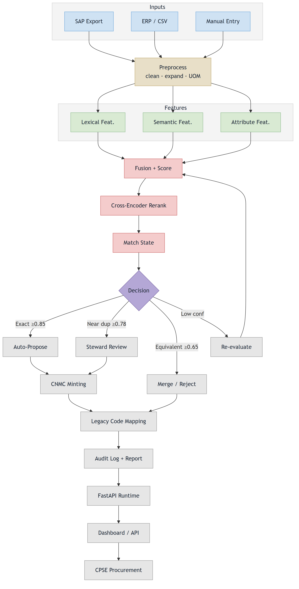
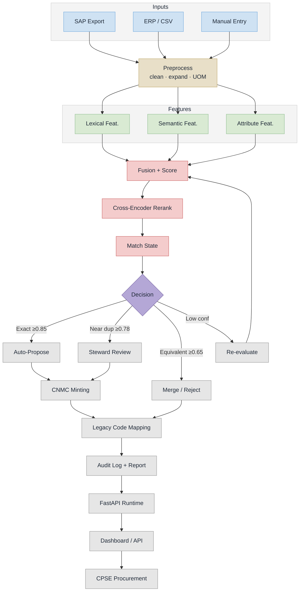

# NUMMF — Implementation Flow (PS 26099)

> Renders on GitHub / Mermaid Live. PNG + SVG regenerate with:
> `npx -y @mermaid-js/mermaid-cli@11 -i implementation-flow.mmd -o implementation-flow.png -b white -s 3`

## Stage notes

| Stage | What runs | Where in code |
|---|---|---|
| Inputs | SAP/ERP export, CSV upload, manual entry | `app/routers/materials.py`, `app/routers/admin.py` |
| Preprocess | lowercase, IS-code strip, grade + UOM normalization, abbreviation expansion | `app/services/normalizer.py` |
| Lexical Feat. | RapidFuzz `token_sort_ratio` (weight 0.30) | `app/services/matching_engine.py` |
| Semantic Feat. | bi-encoder `all-MiniLM-L6-v2` cosine similarity (weight 0.40) | `app/ml/embeddings.py` |
| Attribute Feat. | family / material type / UOM compatibility (weight 0.30) | `app/services/matching_engine.py` |
| Fusion + Score | blended score, threshold 0.65, top-K shortlist | `_candidate_selection` |
| Cross-Encoder Rerank | `ms-marco-MiniLM-L-6-v2`, sigmoid-normalized, blended 0.6/0.4 | `app/ml/reranker.py` |
| Match State | exact ≥0.85, near-duplicate ≥0.78, equivalent ≥0.65, else partial | `_classify_match_type` |
| Decision | routes to auto-propose / steward review / merge-reject / re-evaluate loop | `app/routers/matching.py` |
| CNMC Minting | `CNMC-{SEGMENT}-{MD5[:6]}` semantic hash | `app/services/cnmc_generator.py` |
| Legacy Code Mapping | golden record + per-CPSE legacy code mapping, migration export | `app/routers/mapping.py` |
| Audit Log + Report | every AI suggestion and human action logged | `app/models/audit.py` |
| Runtime / UI | FastAPI service, React dashboard, analytics + review queue | `app/routers/analytics.py`, `frontend/` |

## Source

