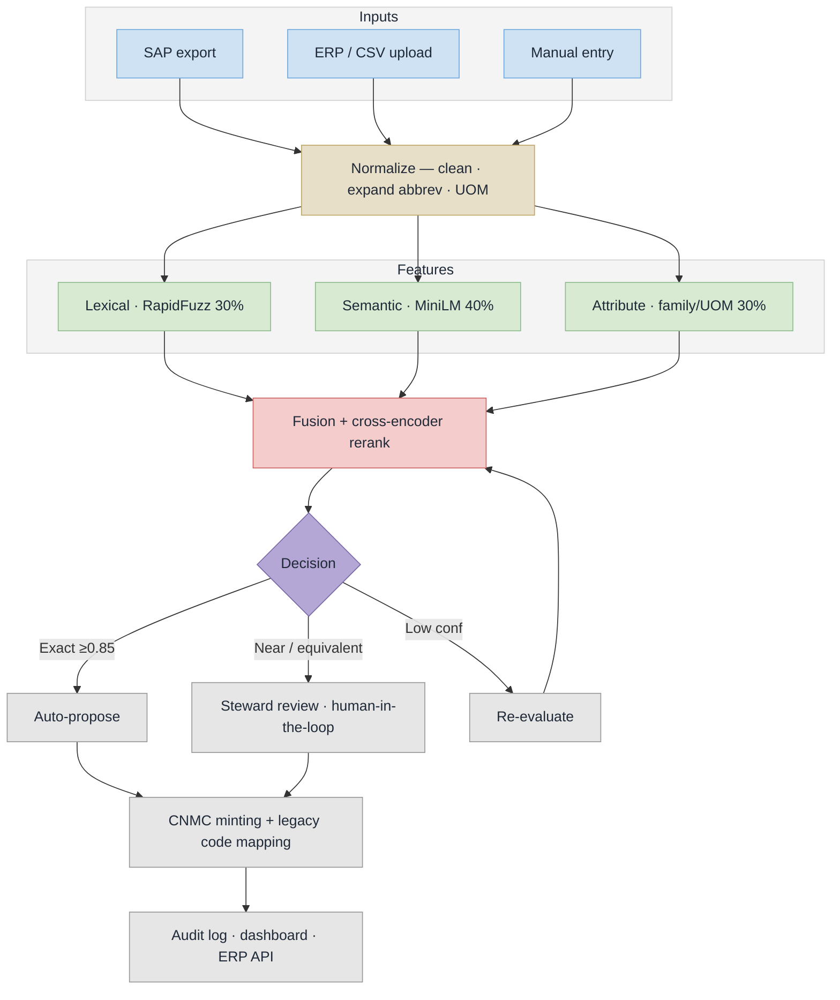

# NUMMF — Implementation Flow (PS 26099)

Four CPSE codes in, one national code out: a narrowing funnel with a human steward at the gate.


Slide-ready: `implementation-flow.svg` (vector — PowerPoint imports SVG natively and it stays sharp at any size) and `implementation-flow.png` (3200x1800, 16:9, drops straight onto a slide).

## How to read it

**Top band — the pipeline, narrowing left to right.** Four material masters describing the same SKF 6205 bearing enter; normalisation, embedding retrieval, explainable scoring and cross-encoder re-ranking cut 5 billion possible pairs down to one verdict; a steward approves before anything goes live; one CNMC golden record comes out with all four legacy codes still mapped.

**Bottom left — what it actually fixes.** The four real descriptions, and the single standardised record they collapse into. This is the slide judges remember.

**Bottom centre — why a funnel, not brute force.** 5 000 000 000 pairs to 50 per item to 5 per item to the hard 2% that reaches a human. It shows engineering judgement rather than "we called an API".

**Bottom right — governance is the product.** Audit trail, legacy mapping, dashboard, ERP integration, air-gapped deployment — the four things a ministry asks about after the demo ends.

## Stage notes

| On the diagram | In the code |
|---|---|
| Normalise | `app/services/normalizer.py` |
| Retrieve (MiniLM embeddings) | `app/ml/embeddings.py` |
| Score (lexical 30 · semantic 40 · attribute 30) | `app/services/matching_engine.py` |
| Re-rank (cross-encoder) | `app/ml/reranker.py` |
| Steward gate | `app/routers/matching.py` |
| CNMC minting + legacy mapping | `app/services/cnmc_generator.py`, `app/routers/mapping.py` |
| Audit trail / dashboard / ERP API | `app/models/audit.py`, `app/routers/analytics.py` |

Thresholds shown in the footer are the live ones: exact >= 0.85, near-duplicate >= 0.78, functional equivalent >= 0.65.

## Regenerate

Edit the SVG by hand, then re-render the PNG with headless Chrome:

```bash
chrome --headless --disable-gpu --force-device-scale-factor=2 --window-size=1600,900 \n  --screenshot=implementation-flow.png implementation-flow.svg
```

## Plain Mermaid variants

Kept for GitHub inline rendering and for anyone who wants a boxes-and-arrows version:
`implementation-flow-mermaid.mmd` (compact) and `implementation-flow-detailed.mmd` / `.png` (every branch broken out).


