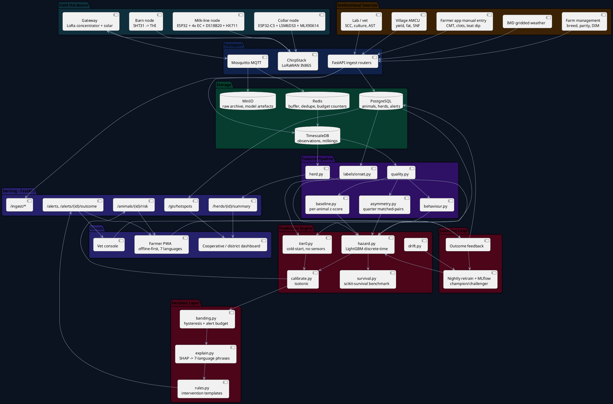

# PRAHARI Architecture Diagram

**PRAHARI** — *Predictive Risk Analytics for Herd Alerting & Rapid Intervention*
An early-warning system for bovine mastitis in Indian dairy herds.
SIH 2026 · PS 26109 · DAHD, Ministry of Fisheries, Animal Husbandry & Dairying · Category: **Hardware**

---

## 1. Mermaid — Full System (`graph TB`)

Renders in GitHub, Notion, Obsidian and the [Mermaid Live Editor](https://mermaid.live).

```mermaid
graph TB
    subgraph FIELD["Field Tier — Hardware on the Animal and in the Milk Line"]
        COLLAR["Collar node<br/>ESP32-C3 + LSM6DS3<br/>+ MLX90614 IR<br/>activity · rumination · udder ΔT<br/>LiFePO4, ~90 day duty cycle"]
        MILK["Milk-line node<br/>ESP32 + 4× SS electrode pair<br/>+ DS18B20 + HX711 load cell<br/>per-quarter EC · milk temp · yield"]
        ENV["Barn node<br/>DHT22 / SHT31 + light<br/>ambient T · RH → THI"]
        GW["Farm gateway<br/>RPi / ESP32 LoRa concentrator<br/>solar + 12V SLA<br/>72 h store-and-forward"]
    end

    subgraph HUMAN["Human & Institutional Tier — Free Signal, No Hardware Needed"]
        APP["Farmer app<br/>CMT score · clots · teat dip<br/>treatments · calving/dry-off"]
        AMCU["Village AMCU<br/>shift yield · fat · SNF<br/>already deployed at scale"]
        LAB["Lab / vet records<br/>SCC · culture · AST<br/>clinical diagnosis"]
        FMS["Farm management data<br/>breed · parity · DIM<br/>vaccination · disease history"]
        IMD["IMD gridded weather<br/>daily T/RH → THI lags"]
    end

    subgraph TRANSPORT["Transport"]
        LORA["LoRaWAN IN865<br/>ChirpStack NS"]
        BLE["BLE → farmer's phone<br/>gateway-less fallback"]
        MQTT["Mosquitto MQTT broker<br/>TLS · per-device creds"]
        REST["FastAPI ingest<br/>REST + batch CSV"]
    end

    subgraph STORE["Storage"]
        TSDB[("TimescaleDB<br/>observations · milkings<br/>hypertables + cont. aggregates")]
        PG[("PostgreSQL<br/>animals · herds · farms<br/>events · alerts · users")]
        OBJ[("MinIO<br/>raw payload archive<br/>thermal frames · model artefacts")]
        REDIS[("Redis<br/>stream buffer · dedupe<br/>alert-budget counters")]
    end

    subgraph PIPE["Feature Pipeline — app/pipeline + app/features"]
        QC["quality.py<br/>pandera contracts<br/>stuck / drift / fouling detection"]
        BASE["baseline.py<br/>per-animal trailing median + MAD<br/><b>the cow is her own control</b>"]
        ASYM["asymmetry.py<br/>max/median EC across 4 quarters<br/><b>matched-pairs within one udder</b>"]
        BEH["behaviour.py<br/>rumination · activity · lying bouts<br/>deltas vs own baseline"]
        HERDF["herd.py<br/>bulk-tank SCC trend · incidence<br/>milking-order contagion proxy"]
        LBLB["labels/onset.py<br/>onset from CMT / clinical / SCC<br/>positives = [onset−14d, onset−7d]"]
    end

    subgraph ML["Prediction Engine — app/models"]
        HAZ["hazard.py<br/>LightGBM discrete-time hazard<br/>P(onset in next 7–14 d)"]
        T0["tier0.py<br/>management-only cold-start model<br/>works with zero sensors"]
        CAL["calibrate.py<br/>isotonic · AUC-PR reporting"]
        SURV["survival.py<br/>scikit-survival benchmark<br/>time-to-event cross-check"]
        DRIFT["drift.py<br/>PSI on features · per-herd re-tune"]
    end

    subgraph DECIDE["Decision Layer — app/alerts"]
        BUD["banding.py<br/>No/Low/Moderate/High<br/>hysteresis + herd alert budget ≤5%/day"]
        XAI["explain.py<br/>SHAP top-3 drivers<br/>→ phrase catalogue, 7 languages"]
        RULES["rules.py<br/>driver → intervention template<br/>advisory only, never a prescription"]
    end

    subgraph SERVE["Serving — FastAPI :8000"]
        RA["/animals · /animals/{id}/risk"]
        RH["/herds/{id}/summary"]
        RAL["/alerts · /alerts/{id}/outcome"]
        RGIS["/gis/hotspots"]
        RING["/ingest/{mqtt,amcu,lab,manual}"]
        ROAS["OpenAPI 3.1 · ICAR-ADE-shaped export"]
    end

    subgraph CLIENTS["Clients"]
        FARM["Farmer PWA / React Native<br/>offline-first · 7 languages<br/>voice prompts for low literacy"]
        VET["Vet console<br/>triage queue · drivers · history<br/>one-tap outcome capture"]
        COOP["Cooperative / district dashboard<br/>herd league table · bulk-tank SCC<br/>MapLibre hotspot layer"]
    end

    subgraph NOTIFY["Notification"]
        FCM["FCM push"]
        SMS["SMS gateway<br/>DLT-registered templates"]
        IVR["IVR / voice callout<br/>optional, low-literacy path"]
    end

    subgraph LOOP["Continuous Learning"]
        FB["Outcome feedback<br/>confirmed / not / treated"]
        RETRAIN["Nightly retrain job<br/>MLflow-tracked · shadow eval<br/>promote only if AUC-PR improves"]
    end

    COLLAR --> LORA
    MILK --> LORA
    ENV --> LORA
    COLLAR -.no gateway.-> BLE
    LORA --> GW --> MQTT
    BLE --> REST
    APP --> REST
    AMCU --> REST
    LAB --> REST
    FMS --> REST
    IMD --> REST

    MQTT --> REDIS --> TSDB
    REST --> TSDB
    REST --> PG
    MQTT --> OBJ

    TSDB --> QC
    QC --> BASE
    QC --> ASYM
    QC --> BEH
    TSDB --> HERDF
    PG --> LBLB
    PG --> HERDF

    BASE --> HAZ
    ASYM --> HAZ
    BEH --> HAZ
    HERDF --> HAZ
    PG --> T0
    LBLB -.trains.-> HAZ
    LBLB -.trains.-> T0
    HAZ --> CAL
    T0 --> CAL
    HAZ -.benchmarked against.-> SURV
    CAL --> BUD
    BUD --> XAI --> RULES

    RULES --> RAL
    CAL --> RA
    HERDF --> RH
    PG --> RGIS

    RA --> FARM
    RAL --> FARM
    RAL --> VET
    RH --> COOP
    RGIS --> COOP
    RING --> TSDB

    RAL --> FCM
    RAL --> SMS
    RAL --> IVR

    VET --> FB
    FARM --> FB
    FB --> PG
    FB --> RETRAIN
    DRIFT --> RETRAIN
    RETRAIN -.promoted model.-> HAZ

    classDef hw fill:#0e7490,stroke:#155e75,color:#fff;
    classDef human fill:#b45309,stroke:#92400e,color:#fff;
    classDef trans fill:#1d4ed8,stroke:#1e3a8a,color:#fff;
    classDef store fill:#065f46,stroke:#064e3b,color:#fff;
    classDef pipe fill:#7c3aed,stroke:#5b21b6,color:#fff;
    classDef ml fill:#be123c,stroke:#9f1239,color:#fff;
    classDef serve fill:#4338ca,stroke:#3730a3,color:#fff;

    class COLLAR,MILK,ENV,GW hw;
    class APP,AMCU,LAB,FMS,IMD human;
    class LORA,BLE,MQTT,REST trans;
    class TSDB,PG,OBJ,REDIS store;
    class QC,BASE,ASYM,BEH,HERDF,LBLB pipe;
    class HAZ,T0,CAL,SURV,DRIFT,BUD,XAI,RULES ml;
    class RA,RH,RAL,RGIS,RING,ROAS serve;
```



---

## 2. Mermaid — Sequence Diagram of One Milking-to-Alert Cycle

This is the diagram for the "how it actually works" slide. It shows the **alert budget** as a first-class actor, because restraint is the product.

```mermaid
sequenceDiagram
    autonumber
    participant COW as Cow 47 (quarter RR)
    participant MN as Milk-line node
    participant CN as Collar node
    participant GW as LoRa gateway
    participant ING as FastAPI ingest
    participant TS as TimescaleDB
    participant FE as Feature builder
    participant M as LightGBM hazard model
    participant B as Alert budget + banding
    participant APP as Farmer app
    participant VET as Vet console

    Note over COW: 05:40 IST — morning milking
    MN->>MN: sample EC per quarter, 4 electrode pairs
    MN->>MN: milk temp (DS18B20), yield (HX711)
    MN->>GW: LoRa uplink — 1 record, 24 bytes
    CN->>CN: 25 Hz accel, on-node classifier
    CN->>GW: 15-min summary — activity idx, rumination min, udder ΔT

    alt gateway online
        GW->>ING: MQTT publish (TLS, per-device creds)
    else no backhaul
        GW->>GW: store-and-forward, up to 72 h
        Note right of GW: replayed in order;<br/>ingest is idempotent on<br/>(device, ts, channel)
    end

    ING->>TS: INSERT observations, milkings (hypertable)

    Note over FE: 06:10 IST — feature build for the morning session
    FE->>TS: SELECT trailing 10 milkings for cow 47
    FE->>FE: robust z-score vs HER OWN median + MAD
    FE->>FE: quarter asymmetry — max/median EC, same udder, same milking
    FE->>FE: rumination Δ = −38 min vs own baseline
    FE->>FE: context — parity 3, DIM 62, HF-cross, THI(7d lag) = 78
    FE->>TS: SELECT herd-pressure features (bulk SCC trend, incidence)

    FE->>M: cow-day feature vector
    M-->>FE: raw score
    FE->>FE: isotonic calibration → p = 0.68

    FE->>B: candidate alert (cow 47, p=0.68)
    B->>B: herd budget check — 1 alert used of 2 (40-cow herd, 5% cap)

    alt within budget AND p ≥ 0.60 (enter threshold)
        B->>B: band = HIGH (hysteresis: exits only below 0.45)
        B->>B: SHAP top-3 → {quarter EC asymmetry 2.1×, rumination −38 min, THI 7d}
        B->>B: driver → intervention template
        B->>APP: push (Hindi) "गाय 47 — दाहिना पिछला थन: कल सुबह स्ट्रिप कर के CMT करें"
        B->>VET: escalate to triage queue with driver panel
    else budget exhausted
        B->>TS: record as WATCHLIST, no notification
        Note right of B: re-scored at the next milking;<br/>a system that flags 8 of 40 cows<br/>gets uninstalled on day four
    end

    Note over APP: 06:30 IST — farmer strips the quarter, runs CMT
    APP->>ING: outcome = CMT score 2, visible flakes → CONFIRMED
    ING->>TS: INSERT alert_outcome

    Note over M: 02:00 IST nightly — retrain
    M->>TS: pull all cow-days + outcomes
    M->>M: refit, shadow-evaluate against current champion
    alt AUC-PR improves on held-out herds
        M->>M: promote challenger, log to MLflow
    else no improvement
        M->>M: keep champion, log the attempt
    end
```

---

## 3. PlantUML — Component View

Paste into [plantuml.com/plantuml](https://www.plantuml.com/plantuml/uml/).



---

## 4. ASCII — Deployment Diagram

Two halves: what sits on the farm, and what sits in the cloud. The farm half must keep working with the cloud half unreachable, because rural backhaul is not a solved problem.

```
  ┌─ ON THE FARM ────────────────────────────────────────────────────────────────┐
  │                                                                              │
  │   ╔═══════════════════╗   ╔═══════════════════╗   ╔═══════════════════╗     │
  │   ║ COLLAR NODE ×N    ║   ║ MILK-LINE NODE ×1 ║   ║ BARN NODE ×1      ║     │
  │   ║ ESP32-C3          ║   ║ ESP32             ║   ║ ESP32 + SHT31     ║     │
  │   ║ LSM6DS3 accel     ║   ║ 4× SS electrode   ║   ║ ambient T / RH    ║     │
  │   ║ MLX90614 IR       ║   ║ DS18B20 milk T    ║   ║ → THI             ║     │
  │   ║ SX1276 LoRa       ║   ║ HX711 + load cell ║   ║ mains or solar    ║     │
  │   ║ LiFePO4 · ~90 d   ║   ║ SX1276 LoRa       ║   ╚═══════════════════╝     │
  │   ╚═════════╤═════════╝   ╚═════════╤═════════╝            │                │
  │             │  LoRaWAN IN865        │                      │                │
  │             └───────────┬───────────┴──────────────────────┘                │
  │                         ▼                                                    │
  │            ┌────────────────────────────────┐        ┌────────────────────┐ │
  │            │  FARM GATEWAY                  │        │  FARMER PHONE      │ │
  │            │  RPi 4 / ESP32 concentrator    │        │  PWA, offline-first│ │
  │            │  ChirpStack (packet fwd)       │◀─BLE──▶│  IndexedDB queue   │ │
  │            │  SQLite spool — 72 h buffer    │        │  syncs when online │ │
  │            │  solar 20 W + 12 V 7 Ah SLA    │        └────────────────────┘ │
  │            │  4G dongle / NB-IoT backhaul   │                               │
  │            └───────────────┬────────────────┘                               │
  └────────────────────────────┼────────────────────────────────────────────────┘
                               │  MQTT over TLS (or batched HTTPS on flaky links)
                               ▼
  ┌─ CLOUD (single 8 vCPU / 16 GB / 200 GB VM is enough for ~500 herds) ─────────┐
  │  docker network: prahari_net                                                 │
  │                                                                              │
  │   ┌──────────────┐   ┌───────────────────┐   ┌──────────────────────────┐   │
  │   │ caddy :443   │──▶│ api               │──▶│ postgres + timescaledb   │   │
  │   │ TLS, SPA,    │   │ FastAPI :8000     │   │ :5432                    │   │
  │   │ /api proxy   │   │ uvicorn ×4        │   │ hypertables:             │   │
  │   └──────┬───────┘   │ OpenAPI 3.1       │   │  observations            │   │
  │          │           └─────────┬─────────┘   │  milkings                │   │
  │   ┌──────┴───────┐             │             │ cont. aggregates:        │   │
  │   │ frontend     │             │             │  cow_daily, herd_daily   │   │
  │   │ React build  │             │             └──────────┬───────────────┘   │
  │   └──────────────┘             │                        ▲                    │
  │                                │             ┌──────────┴───────────────┐   │
  │   ┌──────────────────────┐     │             │ worker (Celery)          │   │
  │   │ mosquitto :8883      │─────┼────────────▶│ feature build · scoring  │   │
  │   │ per-device TLS creds │     │             │ nightly retrain          │   │
  │   └──────────────────────┘     │             │ concurrency = 4          │   │
  │                                │             └──────────┬───────────────┘   │
  │   ┌──────────────────────┐     │             ┌──────────┴───────────────┐   │
  │   │ chirpstack           │     │             │ redis :6379              │   │
  │   │ LoRaWAN net server   │     │             │ broker · dedupe          │   │
  │   └──────────────────────┘     │             │ alert-budget counters    │   │
  │                                │             └──────────────────────────┘   │
  │   ┌──────────────────────┐     │             ┌──────────────────────────┐   │
  │   │ minio :9000          │◀────┘             │ mlflow :5000             │   │
  │   │ raw archive          │                   │ champion/challenger log  │   │
  │   │ model artefacts      │                   │ per-herd metrics         │   │
  │   └──────────────────────┘                   └──────────────────────────┘   │
  │                                                                              │
  │   ┌──────────────────────┐   ┌──────────────────────┐                       │
  │   │ prometheus :9090     │──▶│ grafana :3001        │                       │
  │   │ device liveness      │   │ fleet health board   │                       │
  │   │ alert precision      │   │ model drift board    │                       │
  │   └──────────────────────┘   └──────────────────────┘                       │
  │                                                                              │
  │  Volumes: pgdata · miniodata · redisdata · mlruns · grafana_data             │
  └──────────────────────────────────────────────────────────────────────────────┘

                          ▼ consumed by ▼
     ┌──────────────┬──────────────┬──────────────┬──────────────────────┐
     │  Farmer      │  Vet /       │  Dairy       │  DAHD / State AH     │
     │  push + SMS  │  para-vet    │  cooperative │  dept — district GIS │
     │  7 languages │  triage list │  bulk SCC    │  hotspot surveillance│
     └──────────────┴──────────────┴──────────────┴──────────────────────┘
```

### Graceful degradation — the tier ladder

**The deployment unit is the village, not the cow.** India's median dairy holding is under two milking animals, hand-milked, in a shed with no reliable power ([`domain-brief.md`](domain-brief.md) §1, §5). Every global mastitis system — DeLaval, Lely, Afimilk — assumes a robotic parlour and a $50,000+ install. Designing per-cow hardware for that farm is designing for a customer who does not exist in India.

What *does* exist, at **228,374 village societies**, is the Dairy Cooperative Society and its **Automatic Milk Collection Unit** — which already measures fat and SNF per farmer per shift, twice a day, and whose [NDDB technical specification](https://www.nddb.coop/sites/default/files/pdfs/AMCU_Technical%20Specification_.pdf) explicitly designs for *"no regular power supply, non-IT-savvy operators, dusty environments."* The government has already solved the deployment problem. We plug into it.

```
  TIER 0  no hardware at all         farmer/DCS app + animal records + IMD weather
          ────────────────────       management-risk model: breed, parity, DIM,
          ₹0 per animal              season, housing, teat-dip practice, history
                                     → herd-level risk + coarse animal-level risk
                                     → useful on day one, in every village

  TIER 1  existing AMCU feed         shift yield + FAT + SNF per farmer per shift
          ────────────────────       already measured, already twice daily,
          ₹0 per animal              already for tens of millions of animals
                                     → yield-drop and fat/SNF-shift detection
                                     → ZERO new hardware. This is the free lunch.

  TIER 2  AMCU retrofit module       ◀── OUR PRIMARY HARDWARE DELIVERABLE
          ────────────────────       clips onto the AMCU's existing sample path:
          ₹2,722 per society         conductivity + milk temperature + CMT-assist
          = ₹5–27 per animal         → per-farmer EC trend, no extra farmer effort
          (one module serves         → the biggest lead-time gain per rupee spent
           100–500 animals)

  TIER 3  per-animal hardware        3a: handheld quarter wand, ₹2,094 per
          ────────────────────           household, BLE to the farmer's phone,
          ₹419–1,641 per animal          no gateway at all → quarter asymmetry
          organised / commercial     3b: collar, ₹1,641 per animal → rumination,
          herds, or progressive          activity, udder ΔT. Only pays for itself
          households                     above roughly 20 animals
```

Every tier is scored by the **same** calibrated pipeline; the model simply sees more columns, and the calibration and alert budget are re-fit per tier so a Tier-0 farm gets honest probabilities rather than confident nonsense. A cooperative starts at Tier 0/1 across every village on day one, and buys Tier 2 modules out of the losses avoided.

**Amortisation is the whole argument.** A ₹1,641 collar on a two-cow household is ₹820 per animal against a documented ₹1,390 per-lactation subclinical loss — a payback that requires the farmer to believe us *before* they can afford us. A ₹2,722 module at a society serving 300 animals is **₹9 per animal**, and a full village deployment with a gateway is **₹24 per animal**. That is the difference between a pilot and a national programme. Costed BOMs: [`hardware.md`](hardware.md) §4.

---

## 5. ASCII — Data Flow Through the Prediction Math

The one diagram that answers *"is this actually a model, or is it a threshold with a dashboard?"*

```
  RAW MILKING RECORD  (one row of `milkings`, cow 47, morning session)
  ────────────────────────────────────────────────────────────────────────────
  ts 2026-09-04T05:41+05:30 │ animal 47 │ herd KHEDA-DCS-112
  breed HF-cross │ parity 3 │ DIM 62 │ species CATTLE
  EC  LF 5.21  RF 5.34  LR 5.18  RR 7.92  (mS/cm)
  yield_q  LF 2.9  RF 3.1  LR 2.7  RR 1.8  (kg)
  milk_temp 38.4 °C │ session AM
  ────────────────────────────────────────────────────────────────────────────
                                 │
                                 ▼
  ① VALIDATE — range + rate-of-change contracts; electrode-fouling check
     (a probe reading identical values for 6 milkings is fouled, not healthy)
                                 │
                                 ▼
  ② PER-ANIMAL BASELINE — the cow is her own control
     For each quarter q, over her own trailing 10 AM milkings:
         med_q  = median(EC_q)           MAD_q = median(|EC_q − med_q|)
         z_q    = (EC_q − med_q) / (1.4826 · MAD_q)
     RR: med = 5.30, MAD = 0.18  →  z_RR = (7.92 − 5.30)/(0.267) = +9.8
     Breed, parity, stage and season never enter this arithmetic, so they
     cannot confound it. A Murrah buffalo and an HF-cross are each scored
     against themselves.
                                 │
                                 ▼
  ③ QUARTER ASYMMETRY — matched pairs inside one udder, one milking
         A_EC = max_q(EC_q) / median_q(EC_q) = 7.92 / 5.28 = 1.50
         A_Y  = median_q(yield_q) / min_q(yield_q) = 2.80 / 1.80 = 1.56
     Ambient temperature, vacuum level, operator and the cow's mood are
     shared across all four quarters, so they cancel. This is where the
     lead time comes from — not from any single absolute threshold.
                                 │
                                 ▼
  ④ BEHAVIOUR DELTAS from the collar, again vs her own baseline
         Δrumination = −38 min/day   (baseline 486, today 448)
         Δactivity   = −22%           Δlying-bout length = +19%
     Sickness behaviour often precedes the milk signal for environmental
     cases, which is why Tier 3 buys extra days over Tier 2.
                                 │
                                 ▼
  ⑤ CONTEXT + HERD PRESSURE
         parity 3 · DIM 62 (early lactation, elevated risk)
         prior mastitis in RR quarter last lactation = TRUE
         THI(7-day lag) = 78  (heat stress band)
         herd bulk-tank SCC 14-day slope = +12%
         milked immediately after a known Staph-positive cow = TRUE
                                 │
                                 ▼
  ⑥ COW-DAY FEATURE VECTOR  x  ∈ ℝ^~120
     Every feature is either a deviation from the animal's own baseline,
     a within-udder ratio, or a stable covariate. Almost nothing is a
     raw absolute sensor level — that is deliberate.
                                 │
                                 ▼
  ⑦ DISCRETE-TIME HAZARD MODEL
     The unit of prediction is a cow-day. For cow i on day t we model
         h_i(t) = P( clinical onset in (t+7, t+14]  │  no onset by t )
     fitted as a binary LightGBM on cow-days, with positives drawn ONLY
     from the window [onset − 14, onset − 7]. Days in (onset − 7, onset]
     are BLANKED — they are dropped, not labelled negative — because
     including them would let the model learn "she is already sick",
     which is exactly the thing we are not allowed to do.

         label(i,t) = 1   if  onset_i − 14 ≤ t ≤ onset_i − 7
                    = ∅   if  onset_i − 7  <  t ≤ onset_i     ← blanked
                    = 0   otherwise
                                 │
                                 ▼
  ⑧ CALIBRATION — isotonic regression on a held-out fold
     Raw GBM scores are not probabilities. A farmer being told "68%"
     must be right about 68% of the time or the number is theatre.
     We publish the reliability diagram alongside the ROC.
                                 │
                                 ▼
  ⑨ HONEST METRICS — prevalence of clinical mastitis in a cow-day panel
     is on the order of 0.1–0.5%. AUC-ROC will look wonderful and mean
     little. We report, per species and per tier:
         · AUC-PR (primary)          · sensitivity at fixed alert budget
         · precision@k where k = the herd's daily alert budget
         · lead-time distribution: median + IQR of (onset − alert_day)
         · calibration slope / intercept
     Grouped cross-validation is by HERD, never by cow-day — otherwise
     the same cow leaks across folds and every number is fiction.
                                 │
                                 ▼
  ⑩ ALERT BUDGET + HYSTERESIS — the restraint layer
     budget_h = max(1, ceil(0.05 · herd_size))  alerts per day
     rank candidates by calibrated p, take the top budget_h
     band: enter HIGH at p ≥ 0.60, exit only below 0.45
     (hysteresis stops a cow oscillating between bands twice a day)
                                 │
                                 ▼
  ⑪ EXPLAIN → RECOMMEND
     SHAP top-3 for this alert:
         quarter EC asymmetry 1.50×   (+0.21)
         rumination −38 min           (+0.14)
         THI 7-day lag 78             (+0.07)
     → template lookup → "Strip the right-rear quarter before the next
       milking and run a CMT. Milk her last. Post-milking teat dip on all
       four quarters. Do not start antibiotics — call the vet if the CMT
       scores 2 or more." rendered in the farmer's chosen language.
                                 │
                                 ▼
  ⑫ OUTCOME CAPTURE → NIGHTLY RETRAIN
     Every alert closes with confirmed / not-confirmed / treated.
     That is a new label. Champion/challenger: a retrained model is
     promoted only if it beats the incumbent on held-out-herd AUC-PR.
     This is PS capability #5 — "continuously improving" — as a
     mechanism, not an aspiration.
```

---

## 6. Threat Model & Data Governance (one slide's worth)

| Concern | Mitigation |
|---|---|
| Device spoofing | Per-device TLS client certificates on MQTT; ChirpStack OTAA with unique AppKey per node |
| Farmer data ownership | Farm is the data controller; cooperative gets aggregates, DAHD gets de-identified district aggregates only |
| Animal UID linkage | Store the 12-digit national ear-tag ID hashed at rest; join key is farm-local |
| Bad advice liability | Every recommendation is advisory and inspection-oriented; no antibiotic is ever named by the system; vet escalation path always visible |
| Model misuse as a diagnosis | UI language is "risk", never "diagnosis"; the confirmation step (CMT/vet) is mandatory before any outcome is recorded as positive |
| Offline tampering | Gateway spool is append-only with sequence numbers; ingest is idempotent and logs out-of-order replays |

---

## 7. How to Render These

```bash
# Mermaid → PNG/SVG
npm i -g @mermaid-js/mermaid-cli
mmdc -i architecture-diagram.md -o architecture.png -w 3200 -H 1800 -b transparent

# Or: paste the mermaid block into https://mermaid.live and export

# PlantUML → PNG
# paste into https://www.plantuml.com/plantuml/uml/
# or: java -jar plantuml.jar architecture.puml

# The ASCII blocks are meant to be screenshotted from a monospace editor
# at ~13pt for the PPT — they render more legibly than a re-drawn box diagram.
```

---

## 8. Diagram Assets Referenced Elsewhere

| Filename | Status | Used in |
|---|---|---|
| `architecture.png` | **not yet generated** — render from §1 | README, PPT slide 11 |
| `implementation-flow.svg` / `.png` | **not yet generated** — see `implementation-flow.md` | PPT slide 5, README |
| `implementation-flow-full.svg` / `.png` | **not yet generated** | appendix / report |
| `sequence-milking-to-alert.png` | **not yet generated** — render from §2 | PPT slide 5 speaker panel |
| `tier-ladder.png` | **not yet generated** — render from §4 | PPT slide 12 (affordability) |
| `hardware-block.png` | **not yet generated** — see `hardware.md` | PPT slide 6 (hardware) |

None of the raster/vector assets exist in this folder yet; all are reproducible from the source blocks above.
