# PRAHARI — Implementation Flow (PS 26109)

**PRAHARI** — *Predictive Risk Analytics for Herd Alerting & Rapid Intervention*
SIH 2026 · PS 26109 · Department of Animal Husbandry & Dairying (DAHD), Ministry of Fisheries, Animal Husbandry & Dairying
Category: **Hardware**

Twelve noisy signals off a **₹2,722 module bolted to a village milk-collection unit** — one device, three hundred animals, ₹9 each — in; one calibrated 14-day risk score and one specific instruction out: *"Cow 47, right-rear quarter, strip and CMT tomorrow morning, dip post-milking, do not treat yet."*

## Slide panel — use this one


Sized for **half a slide** (about 6.5in x 5.5in, 936 x 792 units). Type is set so it stays legible at that size, so the panel carries the flow only — the supporting argument belongs in the text beside it.

- `implementation-flow.svg` — vector, PowerPoint imports SVG natively and it stays sharp
- `implementation-flow.png` — 2808 x 2376 raster, if SVG import is a problem

> **Status:** neither image file exists in this folder yet. The Mermaid source at the bottom of this page is the authoritative version; render it (see *Regenerate*) or hand-draw the SVG panel from it before the deck is built.

## How to read it

Reads top to bottom, and the cards narrow as the data does. A village society handling 300 animals across 150 farmers produces, over two shifts, roughly **600 AMCU records, 600 conductivity readings and 1,200 temperature samples** — plus, on farms that have opted into Tier 3, up to **1.7 million raw accelerometer samples a day** which never leave the collar. Edge aggregation collapses those to about **2,400 feature-events**; the nightly feature builder collapses everything to **300 animal-day feature vectors**; the model collapses each vector to **one calibrated probability**; the banding and hysteresis layer collapses those to **the ten or fifteen animals across the whole village that anyone will actually walk over and look at tonight.**

That last narrowing is the whole product. A system that flags a fifth of the village is not an early-warning system, it is noise, and the secretary stops opening the app on day four.

The right-hand pills carry the numbers that show judgement rather than "we put a sensor on a cow": `cow is her own control`, `4 quarters, same udder, same milking`, `label window = onset − 14d … onset − 7d`, `alert budget ≤ 5% of herd/day`, and on the caveat row, `EC alone is a weak test — and we say so`.

### The two ideas that carry the whole method

**1. The cow is her own control.** Absolute milk conductivity, yield and activity vary enormously with breed (HF-cross vs Sahiwal vs Murrah buffalo), parity, days-in-milk and season. A global threshold on raw EC is the reason conductivity has a bad reputation in the literature. PRAHARI never compares Cow 47 to the herd; it compares **Cow 47 today to Cow 47's own trailing 10-day baseline for the same milking session**, as a robust z-score. Breed, stage and season fall out of the arithmetic instead of having to be corrected for.

**2. Four quarters, one udder, one milking.** Mastitis is almost always a *quarter-level* event. The strongest early feature we have is not the level of anything — it is the **asymmetry across the four quarters of the same udder at the same milking**: `max_q(EC) / median_q(EC)`, and the same ratio for yield and quarter surface temperature. Ambient temperature, milking vacuum, the cow's stress that morning, and the operator all cancel because all four quarters share them. This is the mastitis analogue of a matched-pairs design, and it is what buys the lead time.

Everything upstream of `Feature builder` exists to make those two comparisons possible; everything downstream exists to turn the resulting probability into an instruction a farmer can carry out before breakfast.

## Stage notes

| On the panel | In the code | What it actually does |
|---|---|---|
| **AMCU retrofit module** *(primary)* | `firmware/amcu/` (ESP32 + SS316 electrodes + ADS1115 + DS18B20) | conductivity and milk temperature off the AMCU's existing sample path — one device per society, ₹9/animal. See [`hardware.md`](hardware.md) §4.1 |
| AMCU / society data | `app/ingest/amcu.py` | the unit's **existing** output — yield, fat, SNF per farmer per shift. Already deployed nationally, zero marginal cost, and almost nobody else will use it |
| Quarter wand | `firmware/wand/` (ESP32 + SS316 pair, BLE) | farmer dips it in each quarter's strip-cup at milking → quarter asymmetry without a parlour, ₹419/animal across a household, no gateway |
| Collar node *(Tier 3, organised herds)* | `firmware/collar/` (ESP32 + MPU6050; LSM6DS3 in production) | activity index, rumination minutes; LoRa uplink every 15 min. 25 Hz raw data never leaves the node |
| Udder-temp station | `firmware/station/` (MLX90614 at the collection point) | shared across the herd rather than one per collar — saves ₹863/animal and gets a better reading |
| Farmer app (manual) | `app/ingest/manual.py` | CMT score, visible clots, teat condition, teat dip done y/n, treatment given |
| Lab records | `app/ingest/lab.py` | SCC, culture + antibiotic sensitivity, milk ELISA; irregular, high-value, sparse |
| Farm management | `app/ingest/farm.py` | breed, parity, DIM, calving/dry-off dates, vaccination, treatment and disease history |
| Environment | `app/ingest/env.py` | on-farm DHT22 + IMD gridded daily → **THI** (temperature–humidity index), with 3/7-day lags |
| Gateway + LoRa | `firmware/gateway/`, ChirpStack | LoRaWAN IN865, store-and-forward for up to 72 h of outage |
| Ingest + buffer | `app/ingest/mqtt.py` | Mosquitto → FastAPI → TimescaleDB hypertables; idempotent on `(device, ts, channel)` |
| Validate & repair | `app/pipeline/quality.py` | pandera contracts, stuck-sensor and drift detection, electrode-fouling flag, gap interpolation with a missingness indicator (never silent fill) |
| Per-animal baseline | `app/features/baseline.py` | trailing 10-milking median + MAD per cow per session → robust z-scores |
| Quarter asymmetry | `app/features/asymmetry.py` | `max/median` and `max/min` ratios across the four quarters, per milking |
| Behaviour features | `app/features/behaviour.py` | rumination-minutes drop, activity drop, lying-bout change, feeding-time change vs own baseline |
| Herd pressure | `app/features/herd.py` | rolling bulk-tank SCC, herd clinical incidence, milking-order neighbours of known-positive cows (contagion proxy) |
| Label builder | `app/labels/onset.py` | onset = first of {clinical record, CMT ≥ 2, SCC > 200k confirmed}; positives are cow-days in **[onset − 14, onset − 7]**; a blanking window kills leakage from the pre-clinical days |
| Risk model | `app/models/hazard.py` | LightGBM discrete-time hazard on cow-days → P(clinical onset in the next 7–14 d) |
| Cold-start model | `app/models/tier0.py` | management-risk-factor-only model for farms with zero sensors — the system must be useful on day one |
| Calibration | `app/models/calibrate.py` | isotonic regression; we report **AUC-PR** and calibration curves, not just AUC-ROC, because prevalence is low |
| Banding + hysteresis | `app/alerts/banding.py` | No / Low / Moderate / High from calibrated probability; hysteresis + a per-herd daily alert budget so the app does not cry wolf |
| Explain | `app/alerts/explain.py` | SHAP top-3 drivers per alert, mapped to plain-language phrases in seven languages |
| Recommend | `app/alerts/rules.py` | driver → intervention template (teat dip, milking order, bedding, strip-and-CMT, vet referral, dry-cow therapy) — advisory, never a prescription |
| Deliver | `app/routers/alerts.py`, FCM + SMS | push to farmer app, escalation to the vet, digest to the cooperative |
| Feedback loop | `app/learn/feedback.py` | every alert gets an outcome (confirmed / not / treated); nightly retrain + drift monitor; this is capability #5 of the PS made concrete |

## The eight PS capabilities, mapped onto the panel

| PS requirement | Where it lands |
|---|---|
| 1. Predict 7–14 days before clinical signs | `Label builder` window + `Risk model` — the model is *trained* on that horizon, not evaluated on it after the fact |
| 2. Animal-wise and herd-level assessment | `Herd pressure` features + the herd roll-up on the dashboard |
| 3. Integrate sensors, FMS, lab, manual | the seven source cards at the top; one `observations` schema, seven adapters |
| 4. Real-time alerts to farmers and vets | `Deliver` — FCM push, SMS fallback, vet escalation |
| 5. Continuously improving models | `Feedback loop` — outcome capture is a first-class UI element, not an afterthought |
| 6. Dashboards and visualisation | serving layer → farmer app, vet console, cooperative/district GIS view |
| 7. Recommend preventive/corrective action | `Explain` → `Recommend`; the SHAP driver *is* the recommendation key |
| 8. Multilingual, mobile | phrase catalogue in 7 languages + PWA/React Native offline-first client |

## Other variants

- `implementation-flow-full.svg` / `.png` — the full-slide version (16:9, 3200 x 1800) with the supporting evidence panels: the sensor-tier ladder, the label-window timeline, and the confusion-matrix / alert-budget box. Good for a dedicated slide, the report, or the appendix.
- `implementation-flow-mermaid.mmd` — plain Mermaid, rendered inline below.
- `implementation-flow-detailed.mmd` / `.png` — Mermaid with every branch broken out (per-tier sensor paths, the offline store-and-forward branch, the vet-feedback retraining loop).

*(None of these variants exist as files yet — they are the intended asset set, matching the layout used for PS 26099 and PS 26056.)*

## Regenerate

Edit the SVG, then re-render the PNG with headless Chrome:

```bash
chrome --headless --disable-gpu --force-device-scale-factor=3 --window-size=936,792 \
  --screenshot=implementation-flow.png implementation-flow.svg
```

Or render straight from the Mermaid source:

```bash
npm i -g @mermaid-js/mermaid-cli
mmdc -i implementation-flow-mermaid.mmd -o implementation-flow.png -w 2808 -H 2376 -b transparent
```

## Mermaid source

```mermaid
flowchart TD
    subgraph SOURCES[" Sources — the tier ladder: useful with NO hardware, better with each tier added "]
        direction LR
        S4["Tier 0 — no hardware<br/>farmer/DCS app: CMT · clots<br/>teat dip · treatments"]
        S3["Tier 1 — existing AMCU<br/>shift yield · fat · SNF<br/>already measured, ₹0"]
        S2["Tier 2 — AMCU module<br/>conductivity · milk temp<br/><b>₹9/animal — primary</b>"]
        S1["Tier 3 — per animal<br/>quarter wand · collar<br/>asymmetry · rumination"]
        S5["Records + IMD<br/>SCC · culture · AST<br/>breed · parity · DIM · THI"]
    end

    EDGE["Edge aggregation on-node — 25 Hz accelerometer never leaves the collar<br/>15-min activity/rumination summaries · one EC record per sample per shift<br/>store-and-forward through 72 h of no network"]

    GW["LoRaWAN IN865 gateway → ChirpStack → MQTT (Mosquitto)<br/>BLE-to-phone fallback where there is no gateway"]

    RAW[("TimescaleDB hypertables<br/>observations · milkings · events")]

    subgraph CLEAN[" Validate & repair "]
        direction LR
        C1["Contracts<br/>pandera · range + rate limits"]
        C2["Sensor health<br/>stuck · drift · electrode fouling"]
        C3["Gaps<br/>interpolate + missingness flag<br/>never a silent fill"]
    end

    subgraph FEAT[" Feature builder — where the lead time comes from "]
        direction LR
        F1["Per-animal baseline<br/>trailing 10-milking median + MAD<br/>→ robust z-score<br/><b>the cow is her own control</b>"]
        F2["Quarter asymmetry<br/>max/median EC across 4 quarters<br/>same udder · same milking<br/><b>a matched-pairs design</b>"]
        F3["Behaviour deltas<br/>rumination · activity · lying bouts"]
        F4["Context<br/>parity · DIM · breed · THI lags<br/>history of this cow's quarters"]
    end

    HERD["Herd-pressure features<br/>bulk-tank SCC trend · herd incidence<br/>milking-order neighbours of positives"]

    LBL["Label builder — onset = first of<br/>{clinical record, CMT ≥ 2, SCC &gt; 200k}<br/>positives = cow-days in [onset − 14d, onset − 7d]<br/>blanking window prevents leakage"]

    MODEL["LightGBM discrete-time hazard on cow-days<br/>P(clinical onset in next 7–14 days)<br/>Tier-0 fallback model for sensor-less farms"]

    CAL["Isotonic calibration<br/>report AUC-PR + calibration curve<br/>prevalence is low — AUC-ROC alone would flatter us"]

    GATE{"Above the herd's<br/>alert budget?<br/>(≤ 5% of herd/day)"}

    HOLD["Hold — keep in the watchlist<br/>re-score at the next milking"]

    BAND["Risk band with hysteresis<br/>No · Low · Moderate · High<br/>enter High at p≥0.6, leave at p&lt;0.45"]

    XAI["SHAP top-3 drivers<br/>→ plain language, 7 Indian languages"]

    REC["Intervention templates<br/>strip &amp; CMT · post-milking teat dip<br/>milking order · bedding · vet referral<br/>advisory, never a prescription"]

    DEL["Deliver — farmer app push · SMS fallback<br/>vet console escalation · cooperative digest<br/>district GIS hotspot layer"]

    FB["Outcome feedback — confirmed / not / treated<br/>captured in one tap in the app"]

    LEARN["Nightly retrain + drift monitor<br/>per-herd threshold re-tuning"]

    S1 --> EDGE
    S2 --> EDGE
    S3 --> GW
    S4 --> RAW
    S5 --> RAW
    EDGE --> GW
    GW --> RAW
    RAW --> C1 --> C2 --> C3
    C3 --> F1
    C3 --> F2
    C3 --> F3
    C3 --> F4
    F1 --> MODEL
    F2 --> MODEL
    F3 --> MODEL
    F4 --> MODEL
    HERD --> MODEL
    LBL -.trains.-> MODEL
    MODEL --> CAL --> GATE
    GATE -->|no| HOLD
    HOLD -.re-score.-> GATE
    GATE -->|yes| BAND
    BAND --> XAI --> REC --> DEL
    DEL --> FB --> LEARN
    LEARN -.updated model.-> MODEL
    LEARN -.new labels.-> LBL

    classDef src fill:#cfe2f3,stroke:#6fa8dc,color:#1f2937;
    classDef edge fill:#fce5cd,stroke:#e69138,color:#1f2937;
    classDef store fill:#e8dfc8,stroke:#bfa76a,color:#1f2937;
    classDef clean fill:#d9ead3,stroke:#8fbc8f,color:#1f2937;
    classDef feat fill:#f4cccc,stroke:#cc6666,color:#1f2937;
    classDef model fill:#b4a7d6,stroke:#7b68a6,color:#1f2937;
    classDef act fill:#e6e6e6,stroke:#999999,color:#1f2937;

    class S1,S2,S3,S4,S5 src;
    class EDGE,GW edge;
    class RAW,C1,C2,C3 store;
    class F1,F2,F3,F4,HERD clean;
    class LBL,MODEL,CAL feat;
    class GATE,HOLD,BAND model;
    class XAI,REC,DEL,FB,LEARN act;

    style SOURCES fill:#f4f4f4,stroke:#d0d0d0,color:#1f2937;
    style CLEAN fill:#f4f4f4,stroke:#d0d0d0,color:#1f2937;
    style FEAT fill:#f4f4f4,stroke:#d0d0d0,color:#1f2937;
```



## Honest caveats to keep on the slide

Judges from DAHD and ICAR will know this domain. These belong on the panel or in the speaker notes, not buried:

1. **Milk electrical conductivity alone is a mediocre test — and we lead with that, we don't hide it.** Meta-analysis puts EC alone at **~66% sensitivity / ~94% specificity** ([PubMed 1532805](https://pubmed.ncbi.nlm.nih.gov/1532805/)); Kandeel et al. 2019 found **AUC < 0.90 for every hand-held EC/ion meter** and concluded they are *not* clinically useful standalone ([PMC6766502](https://pmc.ncbi.nlm.nih.gov/articles/PMC6766502/)); and on the same 93 cows, EC-based models reached AUC 0.843–0.865 against SCC-based models at 0.952–0.981 ([Pan et al. 2025](https://www.frontiersin.org/journals/veterinary-science/articles/10.3389/fvets.2025.1671186/full)). That is precisely why PRAHARI fuses EC with AMCU fat/SNF, yield, behaviour, quarter asymmetry and management risk factors — and why the per-animal baseline matters far more than the raw value. A team whose innovation *is* the conductivity sensor has already lost this argument.
2. **A model is only as good as its onset labels.** Ours come from CMT, clinical records and SCC — all of which are recorded imperfectly on a real Indian farm. The label builder's blanking window and the outcome-feedback loop exist to manage this, not to hide it.
3. **7–14 days is a *distribution*, not a guarantee — and the state of the art is modest.** The only published study we found reporting exactly this horizon with transparent per-window metrics is [Zhou et al., *Animals* 2026](https://doi.org/10.3390/ani16020204): **AUC 0.789, sensitivity 0.500, specificity 0.947 at 14 days**, on 255,772 records from a commercial farm with SCR HR-Tag sensors. That is what we measure ourselves against. Any team promising 95% at a 14-day horizon is either quoting a *point-in-time detection* paper as if it were forecasting, or has leaked the label. We report lead time as a median with an IQR, and we report how often we were early, on time, or too late.
4. **Buffaloes are not cows.** Murrah and Mehsana buffalo milk has different baseline conductivity and SCC behaviour from HF-crossbred cattle. The per-animal-baseline design handles this structurally; we still stratify the validation report by species.
5. **We do not prescribe antibiotics.** The system recommends inspection, hygiene and referral. Treatment decisions stay with the registered veterinarian — which is also the AMR-reduction argument, not a limitation of it.
