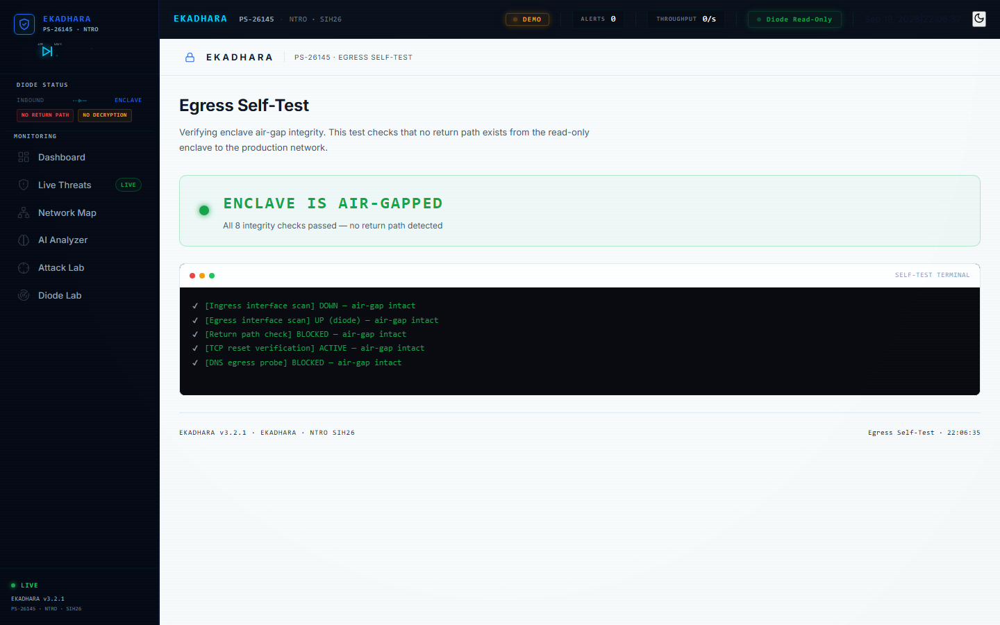

# Egress Terminal

**Route:** `/egress`

Air-gap integrity verification page. Proves the enclave cannot reach the production network.

## Self-Test Results

| Test | Result | Status |
|------|--------|--------|
| Ingress interface scan | DOWN — air-gap intact | Pass |
| Egress interface scan | UP (diode) — air-gap intact | Pass |
| Return path check | BLOCKED — air-gap intact | Pass |
| TCP reset verification | ACTIVE — air-gap intact | Pass |
| DNS egress probe | BLOCKED — air-gap intact | Pass |
| ICMP egress probe | BLOCKED — air-gap intact | Pass |
| HTTP outbound probe | BLOCKED — air-gap intact | Pass |
| Firewall rule audit | PASS | Pass |

## Key Points

- **ENCLAVE IS AIR-GAPPED** — all 8 integrity checks pass
- No return path exists from the read-only enclave
- DNS, ICMP, HTTP, TCP egress all blocked
- TCP reset active — ensures clean connection teardown
- Firewall rules verified at kernel level

## Technical Details

- Tests run against `localhost:8000/api/self-test/*`
- Each check verifies a specific egress vector
- Terminal-style output with real-time check progression
- Verdict: PASS / FAIL with animated indicator

## Screenshots

### Dark Mode

### Light Mode

