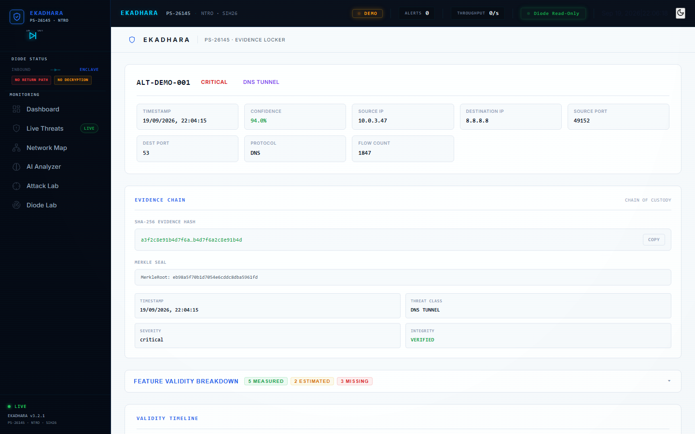

# Evidence Locker

**Route:** `/evidence`

Forensic evidence inspection page. Shows the complete evidence chain for any individual alert.

## Key Sections

| Section | Description |
|---------|-------------|
| **Alert Header** | Alert ID, severity badge, threat class, timestamp, confidence, IPs, ports, protocol, flow count |
| **Evidence Chain** | SHA-256 hash, Merkle seal, chain of custody |
| **Feature Validity Breakdown** | 10 features with validity chips — MEASURED / ESTIMATED / MISSING |
| **Validity Timeline** | Visual timeline of all features colored by validity |
| **Raw Evidence (JSON)** | Expandable raw JSON with full alert details |

## Validity Chips

| Status | Meaning | Color |
|--------|---------|-------|
| MEASURED | Directly captured from traffic | Green |
| ESTIMATED | Inferred via heuristics | Yellow |
| MISSING | Not available in unidirectional mode | Red |

## Technical Details

- Evidence hash: SHA-256 for integrity verification
- Merkle seal: Chain of custody proof
- Integrates with Live Threats — click any alert to navigate here
- All data is timestamped and immutable

## Screenshots

### Dark Mode

### Light Mode

